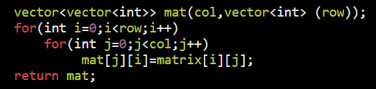

1.  Define = vector\<vector\<int\>\> v(m, vector\<int\> (n, value));

2.  isValidCordinate
bool isValidCordinate(int xi,int yj,int r,int c){

  if(i\>=0 && i\<r && j\>=0 && j\<c) return true;

  return false;

}

2.  use vector to move in all 8 direction

vector\<int\> dx = {1,1,1,-1,-1,-1,0,0};

vector\<int\> dy = {1,0,-1,1,0,-1,1,-1};

for(int k=0;k\<8;k++){

  int x=i+dx\[k\],y=j+dy\[k\];

  if(isValid(x,y,row,col) && condi){

*    // do this*

  }

}

3.  Move on boundaries

*// left -\> right*

for(int i=c1;i\<=c2;i++) mat\[r1\]\[i\]=val++;

*//top to bottom*

for(int i=r1+1;i\<=r2;i++) mat\[i\]\[c2\]=val++;

*// right -\> left*

for(int i=c2-1;i\>=r1;i--) mat\[r2\]\[i\]=val++;

*// bottom to up*

for(int i=r2-1;i\>=r1+1;i--) mat\[i\]\[c1\]=val++;

4.  Transpose

