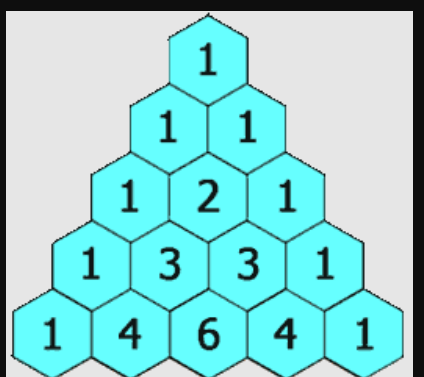

<table>
<colgroup>
<col style="width: 50%" />
<col style="width: 49%" />
</colgroup>
<thead>
<tr class="header">
<th>
<mark>Given R &amp; C</mark>

<mark>Element at R=5 &amp; C=3</mark>

ans=6

<table>
<colgroup>
<col style="width: 100%" />
</colgroup>
<thead>
<tr class="header">
<th>Formulae = r-1Cc-1</th>
</tr>
</thead>
<tbody>
</tbody>
</table>

</th>
<th></th>
</tr>
</thead>
<tbody>
<tr class="odd">
<td>
<mark>Calculate nCr</mark>

10C3 = 10*9*8

3*2*1

</td>
<td>
long long nCr(int n, int r)

{

<blockquote>

long long res = 1;

for (int i = 0; i &lt; r; i++) {

res = res * (n - i);

res = res / (i + 1);

}

return res;

</blockquote>

} 

</td>
</tr>
<tr class="even">
<td>
<mark>Print nth Row of Pacal Triangle</mark>

n = 6

</td>
<td>
vector&lt;int&gt; nthRow(int n)

{

<blockquote>

vector&lt;int&gt; ans;

int res = 1;

ans.push_back(res);

</blockquote>

<blockquote>

for (int i = 1; i &lt; n; i++) {

res = res * (n - i);

res = res / (i);

ans.push_back(res);

}

</blockquote>

<blockquote>

return ans;

</blockquote>

} 

</td>
</tr>
<tr class="odd">
<td>
<mark>Print Entire Pacal triangle</mark> 

vector&lt;vector&lt;int&gt;&gt; generate(int numRows) {

<blockquote>

vector&lt;vector&lt;int&gt;&gt; r(numRows);

for (int i = 0; i &lt; numRows; i++) {

r[i].resize(i + 1);

r[i][0] = r[i][i] = 1;

</blockquote>

<blockquote>

for (int j = 1; j &lt; i; j++)

</blockquote>

r[i][j] = r[i - 1][j - 1] + r[i - 1][j];

  

<blockquote>

}

return r;

</blockquote>

}

</td>
<td>

  vector&lt;int&gt; nthRow(int n)

  {

    vector&lt;int&gt; ans;

    int res = 1;

    ans.push_back(res);

    for (int i = 1; i &lt; n; i++) {

      res = res * (n - i);

      res = res / (i);

      ans.push_back(res);

    }

    return ans;

  }

  vector&lt;vector&lt;int&gt;&gt; generate(int n) {

    vector&lt;vector&lt;int&gt;&gt; ans;

    for(int i=1;i&lt;=n;i++){

      ans.push_back(nthRow(i));

    }

    return ans;

  }

</td>
</tr>
</tbody>
</table>

