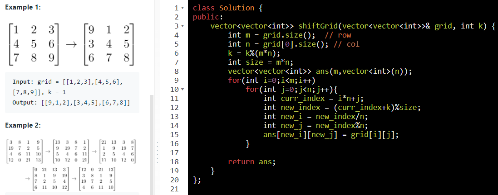

1.  Index if matrix is an array

row = matrix.size()

col = matrix\[0\].size()

i = curr_row in loop

j = curr_col in loop

Index in 1-D = curr_row \* n + curr_col

=== ***(i\*col+j)***==

==========================================

i,j in Matrix for given index in array

==i = index / col==

==j = index % col==

Shift Grid :

Search in Matrix :

