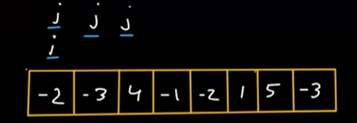

Sub-Array = BF = O(n^2) or O(n^3)

for (int i=0;i\<n-1;i++)

int sum = 0; m // decrease TC n^3 -\> n^2

for(int j=i;j\<n-1;j++)

=================================================

Optimized Algo

1.  Kadanes Algo
- Maximum Sum SubArray
- return {s,e} of Maximum Sum subArray
- Maximum Product SubArray

2.  PreFix sum technique
- Maximum size SubArray with sum k
- No of SubArray with given sum k
- Maxumum size SubArray with sum 0
- contiguous subArray
- SubArray Sum Divisibleby k
- Count SubArray sum Divisible by k

3.  Sliding Window
- Type I : Fixed
- Type II : Variable
