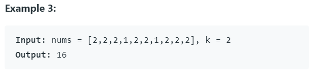
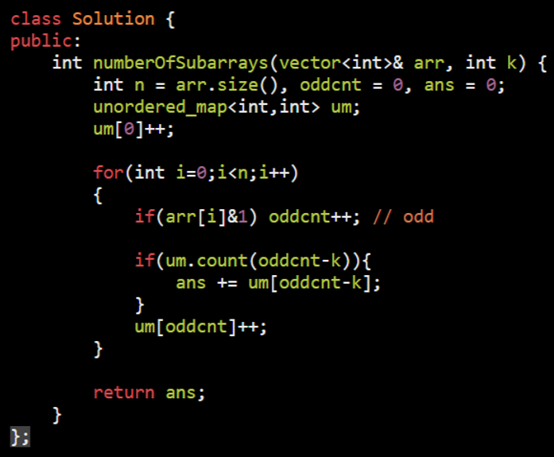

<table>
<colgroup>
<col style="width: 50%" />
<col style="width: 49%" />
</colgroup>
<thead>
<tr class="header">
<th>
<a href="https://leetcode.com/problems/count-number-of-nice-subarrays/">1248. Count Number of Nice Subarrays</a>

</th>
<th>

</th>
</tr>
</thead>
<tbody>
<tr class="odd">
<td>
<a href="https://leetcode.com/problems/find-the-longest-substring-containing-vowels-in-even-counts/">1371. Find the Longest Substring Containing Vowels in Even Counts</a>

0 means the number of occ of the vowel is even

1 means the number of occ of the vowel is odd

<strong>Using prefix state Map</strong>

32 bit:

a:0,e:0,i:0,o:0,u:0 let say uptill this a occer 3 odd

a:1,e:0,i:0,o:0,u:0

.

.

.

a:1,e:1,i:1,o:1,u:1 uptill this a occer 7 odd so betw 4 even

</td>
<td>

</td>
</tr>
</tbody>
</table>

