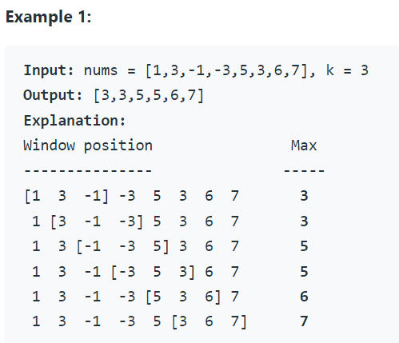
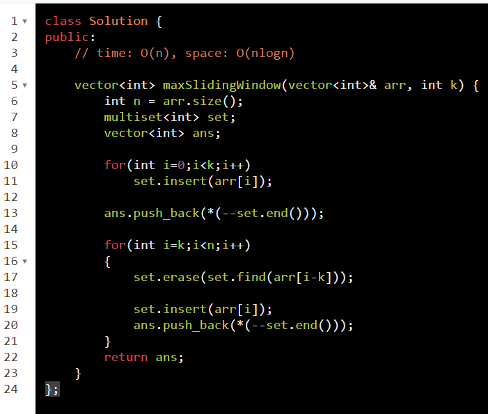
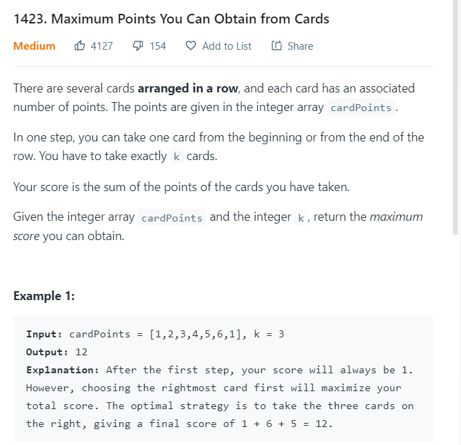
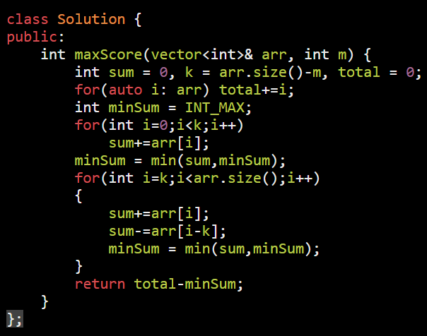
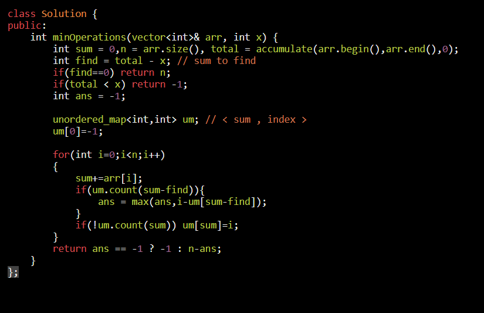

<table>
<colgroup>
<col style="width: 43%" />
<col style="width: 56%" />
</colgroup>
<thead>
<tr class="header">
<th>
<a href="https://leetcode.com/problems/sliding-window-maximum/">239. Sliding Window Maximum</a>

<ol type="1">
<li>
triverse all window = (n-k+1)*k = find max
</li>
<li>
multiset = n*(2log(n))
</li>
<li>
deque = O(n)
</li>
</ol>

--------------------------------------------

// max should be at front : to acieve this

// for this maintain dq in dec order

to insert curr ele

<ol type="1">
<li>
pop front if its idx outside win &amp; also
</li>
<li>
pop from back dir : if ( back &lt; curr )
</li>
<li>
add curr
</li>
</ol></th>
<th>

</th>
</tr>
</thead>
<tbody>
<tr class="odd">
<td>
Sliding Window concept used here

<a href="https://leetcode.com/problems/maximum-points-you-can-obtain-from-cards/">1423. Maximum Points You Can Obtain from Cards</a>

</td>
<td>
Using Sliding Window

operastions = arrSize - winSize with req sum

</td>
</tr>
<tr class="even">
<td>
<a href="https://leetcode.com/problems/minimum-operations-to-reduce-x-to-zero/https:/leetcode.com/problems/minimum-operations-to-reduce-x-to-zero/">1658. Minimum Operations to Reduce X to Zero</a>

</td>
<td><ol type="1">
<li>
Using Prefix sum
</li>
</ol>
<blockquote>

</blockquote>
<ol start="2" type="1">
<li>
Using Sliding Window
</li>
</ol>
<blockquote>

</blockquote></td>
</tr>
</tbody>
</table>

