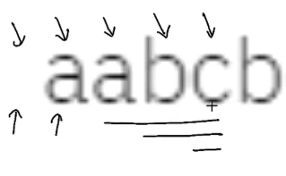
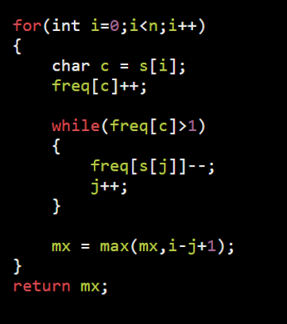
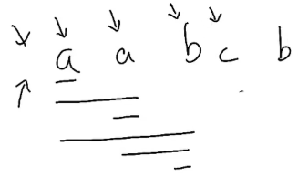
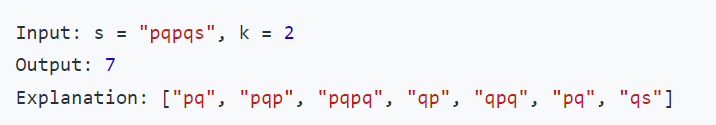

Types :
1.  [All](onenote:#Type%20II%20%20a%20Basic&section-id={0561D0A3-CBFE-49B1-A9DD-DE8B099423FA}&page-id={A4CC7B82-FC48-4B7E-8C49-64D8302D083A}&object-id={25DD83EB-B632-4E84-B4C7-9974318EF2EC}&14&base-path=https://d.docs.live.net/488d82fe7a9fef0f/Documents/PLACEMENT-DSA/ARRAY%202.one) = get All Valid subArr
2.  [AtMost](onenote:#Type%20II%20%20a%20Basic&section-id={0561D0A3-CBFE-49B1-A9DD-DE8B099423FA}&page-id={A4CC7B82-FC48-4B7E-8C49-64D8302D083A}&object-id={E4A57C57-164B-487C-83BF-AC90F0F58677}&CF&base-path=https://d.docs.live.net/488d82fe7a9fef0f/Documents/PLACEMENT-DSA/ARRAY%202.one) = get Atmost k Valid
3.  [Exactly](onenote:#Type%20II%20%20a%20Basic&section-id={0561D0A3-CBFE-49B1-A9DD-DE8B099423FA}&page-id={A4CC7B82-FC48-4B7E-8C49-64D8302D083A}&object-id={98A5B1E9-5A4F-4936-B7AF-CA99E0637487}&86&base-path=https://d.docs.live.net/488d82fe7a9fef0f/Documents/PLACEMENT-DSA/ARRAY%202.one) = Atmost(k) - Atmost(k-1)

<table>
<colgroup>
<col style="width: 52%" />
<col style="width: 47%" />
</colgroup>
<thead>
<tr class="header">
<th><strong>Repeatation Not Allowed</strong></th>
<th></th>
</tr>
</thead>
<tbody>
<tr class="odd">
<td><ol type="1">
<li>
count substr without rep char
</li>
</ol>
<blockquote>

</blockquote>
<table>
<colgroup>
<col style="width: 58%" />
<col style="width: 41%" />
</colgroup>
<thead>
<tr class="header">
<th>a valid</th>
<th>ans=a</th>
</tr>
</thead>
<tbody>
<tr class="odd">
<td>aa invalid -&gt; a</td>
<td>ans=a</td>
</tr>
<tr class="even">
<td>ab valid</td>
<td>ans=ab b</td>
</tr>
<tr class="odd">
<td>abc valid</td>
<td>ans=abc bc c</td>
</tr>
<tr class="even">
<td>abcb invalid -&gt; cb</td>
<td>ans=cb b</td>
</tr>
</tbody>
</table>
<blockquote>

a

a

ab

abc

cb

count = 9

</blockquote></td>
<td>
<em>#include</em> &lt;iostream&gt;

using namespace std;

<em>#include</em> &lt;bits/stdc++.h&gt;

void cntWithoutRep(string &amp;s)

{

  int n = s.size(), cnt = 0;

  unordered_map&lt;int, int&gt; freq;

  int j = 0;

  <em>for</em> (int i = 0; i &lt; n; i++)

  {

    char ch = s[i];

    freq[ch]++;

<em>    // lets make valid</em>

    <em>while</em> (freq[ch] &gt; 1)

    {

      <em>if</em> (freq[s[j]] == 1) freq.erase(s[j]);

      <em>else</em> freq[s[j]]--;

      j++;

    }

    cnt += (i - j + 1);

    cout &lt;&lt; s.substr(j, i - j + 1) &lt;&lt; endl;

  }

  cout &lt;&lt; "count = " &lt;&lt; cnt &lt;&lt; endl;

}

int main()

{

  string s = "aabcb";

  cntWithoutRep(s);

  <em>return</em> 0;

}
</td>
</tr>
<tr class="even">
<td><ol start="2" type="1">
<li>
Longest subStr without rep char
</li>
</ol>
<blockquote>

aabcb ans = 3;

</blockquote>
<table>
<colgroup>
<col style="width: 80%" />
<col style="width: 19%" />
</colgroup>
<thead>
<tr class="header">
<th>add - while</th>
<th>len</th>
</tr>
</thead>
<tbody>
<tr class="odd">
<td>a valid</td>
<td>1</td>
</tr>
<tr class="even">
<td>aa invalid -&gt; a</td>
<td>2</td>
</tr>
<tr class="odd">
<td>ab valid</td>
<td>2</td>
</tr>
<tr class="even">
<td>abc valid</td>
<td>3</td>
</tr>
<tr class="odd">
<td>abcb invalid -&gt; cb</td>
<td>2</td>
</tr>
</tbody>
</table>
<blockquote>

</blockquote></td>
<td></td>
</tr>
<tr class="odd">
<td>

<strong>Repeatation Allowed</strong>
</td>
<td></td>
</tr>
<tr class="even">
<td><ol type="1">
<li>
count subStr at most k distinct char
</li>
</ol>
<blockquote>

"aabcb" ans = 11 k = 3

0k 1k 2k 3k allowed 4k not allowed

</blockquote>
<table>
<colgroup>
<col style="width: 50%" />
<col style="width: 49%" />
</colgroup>
<thead>
<tr class="header">
<th>a valid</th>
<th>ans = a</th>
</tr>
</thead>
<tbody>
<tr class="odd">
<td>aa valid</td>
<td>ans = aa a</td>
</tr>
<tr class="even">
<td>aab valid</td>
<td>ans = aab ab b</td>
</tr>
<tr class="odd">
<td>aabc invalid bc</td>
<td>ans = bc c</td>
</tr>
<tr class="even">
<td>bcb valid</td>
<td>ans = bcb cb b</td>
</tr>
</tbody>
</table>
<blockquote>

a

aa

aab

bc

bcb

count = 11

</blockquote></td>
<td>
<em>#include</em> &lt;iostream&gt;

using namespace std;

<em>#include</em> &lt;bits/stdc++.h&gt;

void atMostK(string &amp;s, int k)

{

  int n = s.size(), cnt = 0;

  unordered_map&lt;int, int&gt; freq;

  int j = 0;

  <em>for</em> (int i = 0; i &lt; n; i++)

  {

    char ch = s[i];

    freq[ch]++;

<em>    // lets make valid</em>

    <em>while</em> (freq.size() &gt; k)

    {

      <em>if</em> (freq[s[j]] == 1) freq.erase(s[j]);

      <em>else</em> freq[s[j]]--;

      j++;

    }

    cnt += (i - j + 1);

    cout &lt;&lt; s.substr(j, i - j + 1) &lt;&lt; endl;

  }

  cout &lt;&lt; "count = " &lt;&lt; cnt &lt;&lt; endl;

}

int main()

{

  string s = "aabcb";

  atMostK(s, 2);

  <em>return</em> 0;

}
</td>
</tr>
<tr class="odd">
<td><ol start="2" type="1">
<li>
longest subStr at most k distinct c
</li>
</ol>
<blockquote>

"aabcb" ans = 3

</blockquote>
<table>
<colgroup>
<col style="width: 47%" />
<col style="width: 52%" />
</colgroup>
<thead>
<tr class="header">
<th>a valid</th>
<th>len = 1</th>
</tr>
</thead>
<tbody>
<tr class="odd">
<td>aa valid</td>
<td>ans = aa a</td>
</tr>
<tr class="even">
<td>aab valid</td>
<td>ans = aab ab b</td>
</tr>
<tr class="odd">
<td>aabc invalid bc</td>
<td>ans = bc c</td>
</tr>
<tr class="even">
<td>bcb valid</td>
<td>ans = bcb cb b</td>
</tr>
</tbody>
</table></td>
<td>
int lengthOfLongestSubstringAtMostKDistinct(string &amp;s, int k) {

  int n = s.size(),maxLen = 0;

  unordered_map&lt;int,int&gt; um;

  int j =0;

  <em>for</em>(int i=0;i&lt;n;i++)

  {

    um[s[i]]++;

    <em>while</em>(um.size()&gt;k){

      <em>if</em>(um[s[j]]==1) um.erase(s[j]);

      <em>else</em> um[s[j]]--;

      j++;

    }

    maxLen = max(maxLen,i-j+1);

  }

  <em>return</em> maxLen;

}
</td>
</tr>
<tr class="even">
<td>

</td>
<td></td>
</tr>
<tr class="odd">
<td><ol type="1">
<li>
Count subStr with Exactly k distinct char
</li>
</ol>
<blockquote>

At most k distinct with k = 3

0k 1k 2k 3k - 0k 1k 2k = 3k

atmost(k) - atmost(k-1) = exactly

other problems

<a href="onenote:#Type%20II%20%20a%20Hard&amp;section-id={0561D0A3-CBFE-49B1-A9DD-DE8B099423FA}&amp;page-id={354B819C-4CFB-4CAC-ADE9-E3E5768F2F47}&amp;object-id={FCE3C327-20D2-40F7-A0CD-17C26A10022C}&amp;10&amp;base-path=https://d.docs.live.net/488d82fe7a9fef0f/Documents/PLACEMENT-DSA/ARRAY%202.one">Sliding Window + "At Most to Equal" trick To</a>

</blockquote></td>
<td>
<em>#include</em> &lt;iostream&gt;

using namespace std;

<em>#include</em> &lt;bits/stdc++.h&gt;

<em>// the number of subarrays with at most K distinct elements</em>

int most_k_chars(string &amp;s, int k) {

  int n = s.size(), anss = 0;

  unordered_map&lt;char, int&gt; um;

  int j = 0;

  <em>for</em> (int i = 0; i &lt; n; i++) {

    um[s[i]]++;

 

    <em>while</em> (um.size() &gt; k) {

      <em>if</em>(um[s[j]]==1) um.erase(s[j]);

      <em>else</em> um[s[j]]--;

      j++;

    }

    anss += i - j + 1;

  }

  <em>return</em> anss;

}

int exact_k_chars(string &amp;s, int k) {

  <em>return</em> most_k_chars(s, k) - most_k_chars(s, k - 1);

}

int main() {

  string s1 = "pqpqs";

  cout &lt;&lt; "Answer should be 7: "

&lt;&lt; exact_k_chars(s1, 2) &lt;&lt; endl;

}
</td>
</tr>
<tr class="even">
<td><ol start="2" type="1">
<li>
longest SubStr exactly k distinct char
</li>
</ol>
<blockquote>

Minor change in code

</blockquote></td>
<td></td>
</tr>
</tbody>
</table>

