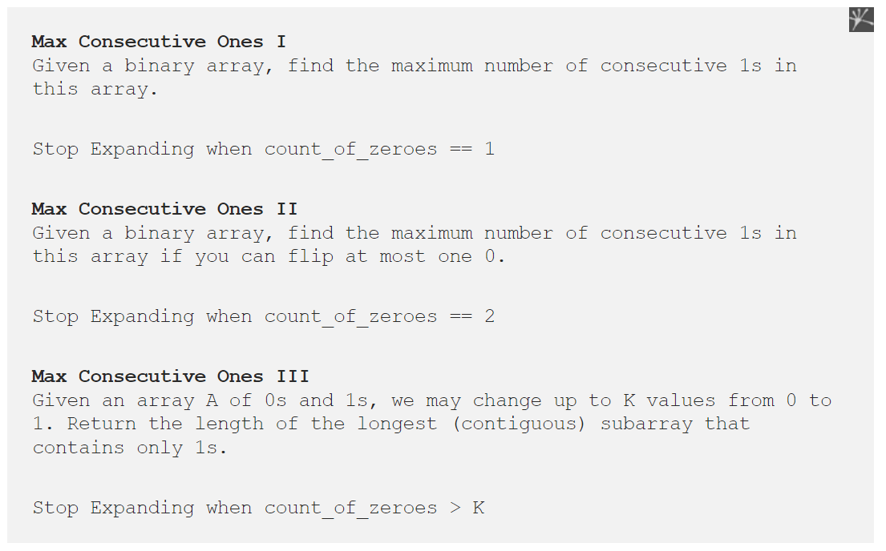
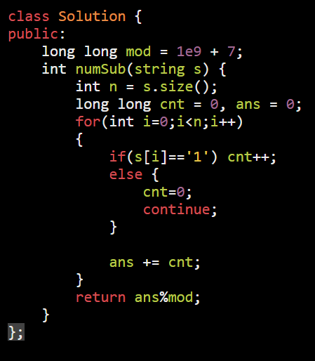
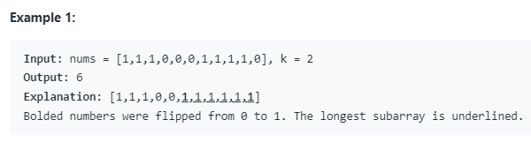
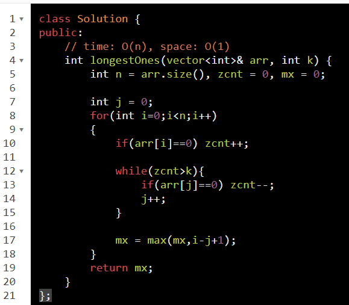
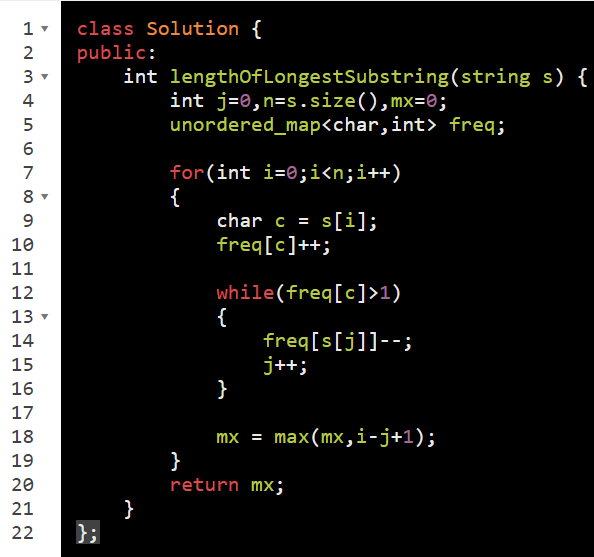
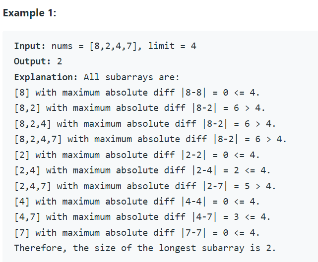
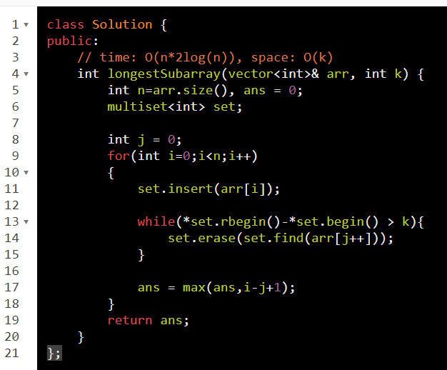
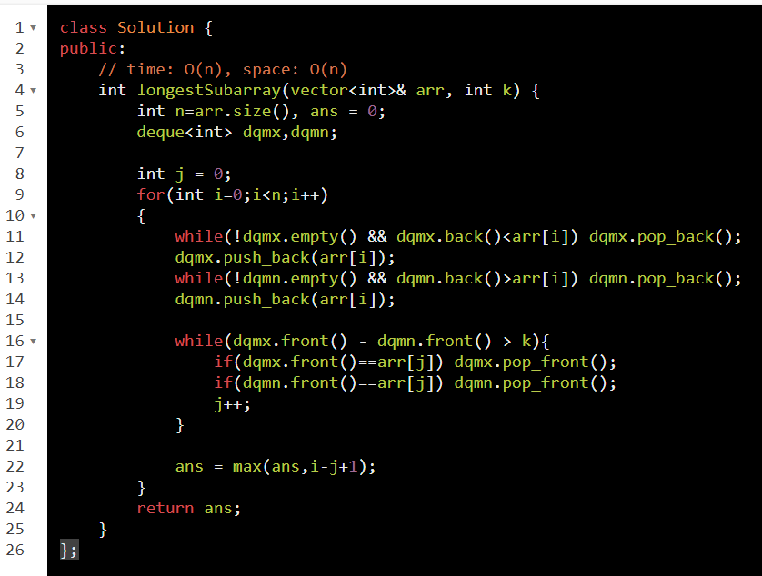

While reducing those are not our ans : read below example
While reducing those can be possible ans : [Link](onenote:#Type%20II%20%20level%202&section-id={0561D0A3-CBFE-49B1-A9DD-DE8B099423FA}&page-id={89A235C9-683A-4A97-BA88-E5B749C59FD0}&end&base-path=https://d.docs.live.net/488d82fe7a9fef0f/Documents/PLACEMENT-DSA/ARRAY%202.one)

=========================================================================
Basic template of such problems is basically 3 steps.

**Step1**: Have a counter or hash-map to count specific array input and keep on increasing the window toward right using outer loop.

**Step2**: Have a while loop inside to reduce the window side by sliding toward right. Movement will be based on constraints of problem. Go through few examples below

**Step3**: Store the current maximum window size or minimum window size or number of windows based on problem requirement.

map \| set \| cnt // To store window
int j = 0;
for(int i=0;i\<n;i++){
map insert // increment window from back

// let's make window valid

while(invalid) {

map reduce // decrement window from front

j--;

}

store ans // calculate ans
}

==========================================================================

<table>
<colgroup>
<col style="width: 51%" />
<col style="width: 48%" />
</colgroup>
<thead>
<tr class="header">
<th>

</th>
<th></th>
</tr>
</thead>
<tbody>
<tr class="odd">
<td>
<a href="https://leetcode.com/problems/max-consecutive-ones/">485. Max Consecutive Ones</a>

<strong>Input:</strong> nums = [1,0,1,1,0,1] 
<strong>Output:</strong> 2

</td>
<td>
<a href="https://leetcode.com/problems/number-of-substrings-with-only-1s/">1513.Number of Substrings With Only 1s</a>

<strong>Input:</strong> s = "0110111" 
<strong>Output:</strong> 9

</td>
</tr>
<tr class="even">
<td></td>
<td></td>
</tr>
<tr class="odd">
<td>
<a href="https://leetcode.com/problems/max-consecutive-ones-iii/">1004. Max Consecutive Ones III</a>

We can flip k 0 to 1 so find l(mac cons.. 1's)

<blockquote>

</blockquote>
<ol type="1">
<li>
always aquire num
</li>
<li>
release untill become valid
</li>
</ol>
<blockquote>

: while(inValid) untill = valid

</blockquote>
<ol start="3" type="1">
<li>
cnt ans always
</li>
</ol>
<blockquote>

</blockquote>

// Think about it if min asked you have to add

// min in while loop and cnt while reducing window

// check level2

</td>
<td>

</td>
</tr>
</tbody>
</table>

------------------------------------------------------------------------------------------
[1493. Longest Subarray of 1's After Deleting One Element](https://leetcode.com/problems/longest-subarray-of-1s-after-deleting-one-element/)

same but changes
We need : question
Must delete one element (therefore flag)
if no zero then delete one
& max(Len, i-j+1-cnt0) // cnt0 there needed

[3. Longest Substring Without Repeating Characters](https://leetcode.com/problems/longest-substring-without-repeating-characters/)

[713. Subarray Product Less Than K](https://leetcode.com/problems/subarray-product-less-than-k/)

[1695. Maximum Erasure Value](https://leetcode.com/problems/maximum-erasure-value/)

[1438. Longest subArr with max - min \<= k](https://leetcode.com/problems/longest-continuous-subarray-with-absolute-diff-less-than-or-equal-to-limit/)

// just more optimised with deque

