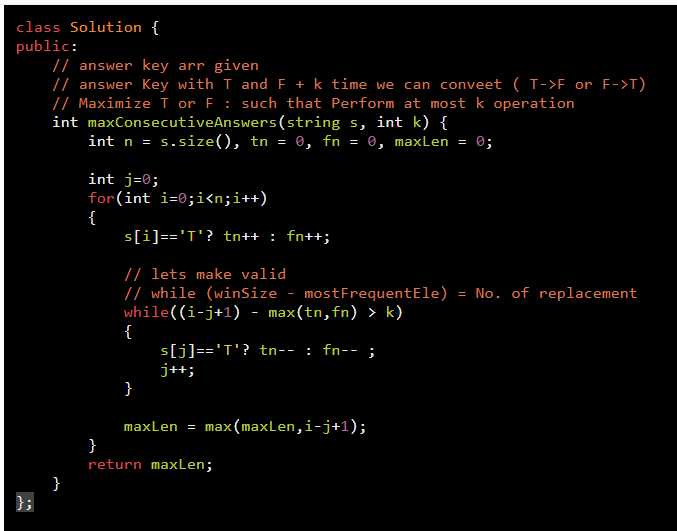
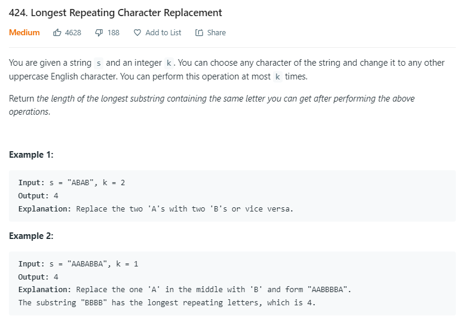
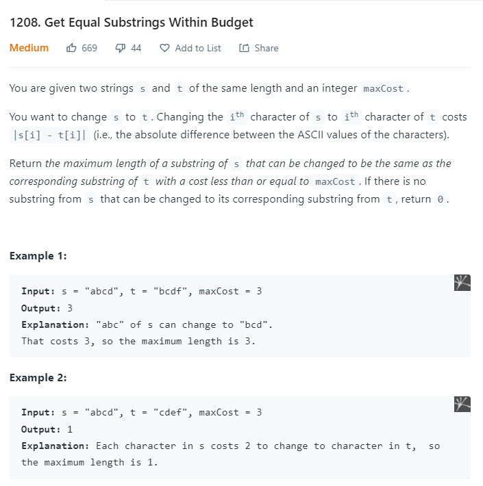
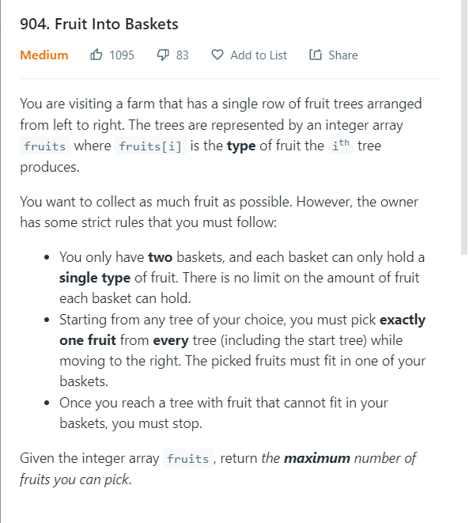
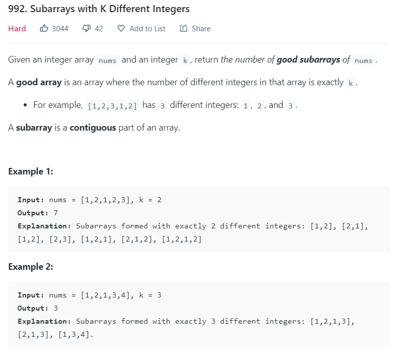
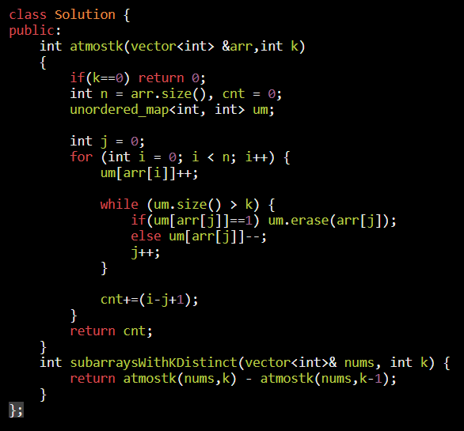
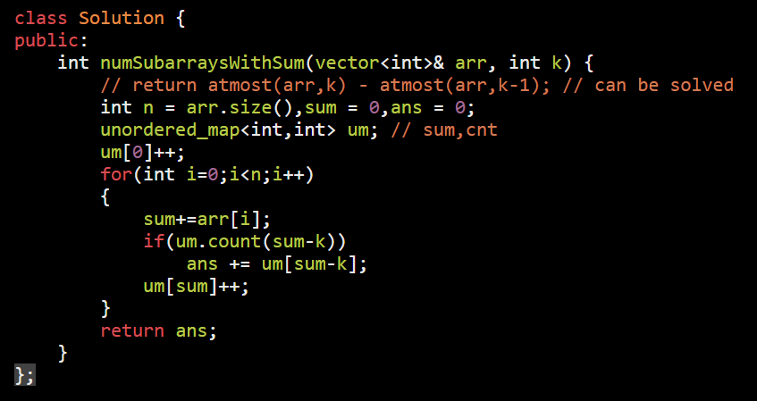
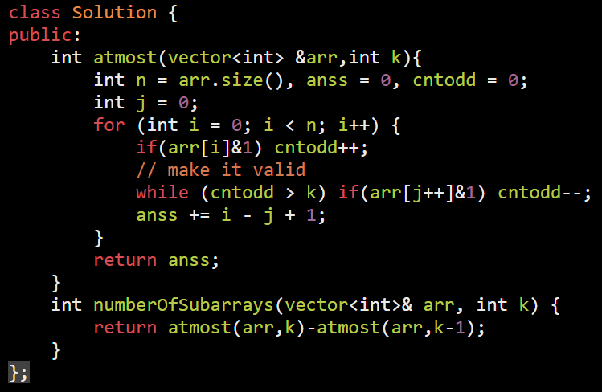

[424. Longest Repeating Character Replacement](https://leetcode.com/problems/longest-repeating-character-replacement/)

<table>
<colgroup>
<col style="width: 39%" />
<col style="width: 60%" />
</colgroup>
<thead>
<tr class="header">
<th>
<a href="https://leetcode.com/problems/maximize-the-confusion-of-an-exam/">2024. Maximize the Confusion of an Exam</a>

concept used;

No of replacement to make SubArr equal:

SubarrSize - freq of char occer max time

</th>
<th>

</th>
</tr>
</thead>
<tbody>
<tr class="odd">
<td>
concept used;

No of replacement to make SubArr equal:

SubarrSize - freq of char occer max time

ex. "AABABBA" k=2 //1 replacement possible

<table>
<colgroup>
<col style="width: 20%" />
<col style="width: 79%" />
</colgroup>
<thead>
<tr class="header">
<th></th>
<th>replacemnt to make array equal</th>
</tr>
</thead>
<tbody>
<tr class="odd">
<td>A</td>
<td>rep = 0</td>
</tr>
<tr class="even">
<td>AA</td>
<td>rep = 0</td>
</tr>
<tr class="odd">
<td>AAB</td>
<td>rep = 3-2 = 1</td>
</tr>
<tr class="even">
<td>AABA</td>
<td>rep = 4-3 = 1</td>
</tr>
<tr class="odd">
<td>AABAB</td>
<td>
rep = 5-3 = 2 invalid -&gt; ABAB

rep = 4-2 = 2 invalid -&gt; BAB

rep = 3-2 = 1 valid
</td>
</tr>
<tr class="even">
<td>-BABBA</td>
<td>rep = 5-3 = 2 invalid --&gt; BBA</td>
</tr>
</tbody>
</table>

</td>
<td>

</td>
</tr>
<tr class="even">
<td>
<a href="https://leetcode.com/problems/frequency-of-the-most-frequent-element/">1838. Frequency of the Most Frequent Element</a>

</td>
<td>

Sort is imp

</td>
</tr>
<tr class="odd">
<td>
<a href="https://leetcode.com/problems/get-equal-substrings-within-budget/">1208. Get Equal Substrings Within Budget</a>

</td>
<td>

</td>
</tr>
<tr class="even">
<td>
<a href="https://leetcode.com/problems/fruit-into-baskets/">904. Fruit Into Baskets</a>

</td>
<td>

<strong>Word Problem</strong>

Questino seems defficult but conversion of it into simpler one is this

What is the length of longest subarray that contains up to two distinct integers?

</td>
</tr>
<tr class="odd">
<td>
<strong>Sliding Window + "At Most to Equal" trick To Find Exactly contain Element count</strong>

It's because "number of windows with exactly k something in it" = "number of windows with at most k something in it" - "number of windows with at most k - 1 something in it".

Base Problem <a href="onenote:#Type%20II%20%20a%20string&amp;section-id={0561D0A3-CBFE-49B1-A9DD-DE8B099423FA}&amp;page-id={A4CC7B82-FC48-4B7E-8C49-64D8302D083A}&amp;object-id={98A5B1E9-5A4F-4936-B7AF-CA99E0637487}&amp;86&amp;base-path=https://d.docs.live.net/488d82fe7a9fef0f/Documents/PLACEMENT-DSA/ARRAY%202.one">Link</a>

</td>
<td>
The following problems are also solvable using the shrinkable template with the "At Most to Equal" trick

930. Binary Subarrays With Sum (Medium)

992. Subarrays with K Different Integers

1248. Count Number of Nice Subarrays (Medium)

2062. Count Vowel Substrings of a String (Easy)
</td>
</tr>
<tr class="even">
<td>
<a href="https://leetcode.com/problems/subarrays-with-k-different-integers/submissions/">992. Subarrays with K Different Integers</a>

</td>
<td>

</td>
</tr>
<tr class="odd">
<td>
<a href="https://leetcode.com/problems/binary-subarrays-with-sum/">930. Binary Subarrays With Sum</a>

Can be solved in both way

<ol type="1">
<li>
atmostSum(k) - atmostSum(k-1) = Exactly sum k
</li>
</ol>
<blockquote>

O(1) space

</blockquote>
<ol start="2" type="1">
<li>
Prefix Sum = O(n) space
</li>
</ol>

</td>
<td>

</td>
</tr>
<tr class="even">
<td>
<a href="https://leetcode.com/problems/count-number-of-nice-subarrays/submissions/">1248. Count Number of Nice Subarrays</a>

<a href="onenote:#no%20releation&amp;section-id={0561D0A3-CBFE-49B1-A9DD-DE8B099423FA}&amp;page-id={A98248C7-3EFA-49A4-866C-9C727DE2B224}&amp;object-id={730F1010-044C-4F7B-AD93-BD6AC4C5C097}&amp;40&amp;base-path=https://d.docs.live.net/488d82fe7a9fef0f/Documents/PLACEMENT-DSA/ARRAY%202.one">PrefixSum Soluation</a> = With Extra Space O(n)

</td>
<td></td>
</tr>
<tr class="odd">
<td>
<a href="https://leetcode.com/problems/count-vowel-substrings-of-a-string/">2062. Count Vowel Substrings of a String</a>

Count No. of substring Must contain all Vowels

</td>
<td></td>
</tr>
<tr class="even">
<td></td>
<td></td>
</tr>
</tbody>
</table>

