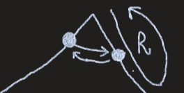

<table>
<colgroup>
<col style="width: 51%" />
<col style="width: 48%" />
</colgroup>
<thead>
<tr class="header">
<th></th>
<th>

</th>
</tr>
</thead>
<tbody>
</tbody>
</table>

class Solution {
public:
  void nextPermutation(vector\<int\>& arr) {
    int n = arr.size();
    int i = n-2;
    while(i\>=0)
    {
      if(arr\[i\] \< arr\[i+1\]) break;
      i--;
    }
    // i = -1 or i \>= 0
    if(i == -1){
      reverse(arr.begin(),arr.end());
      return;
    }

    int j; // find just grater then arr\[i\]
    for(j=n-1;j\>=0;j--){
      if(arr\[j\] \> arr\[i\]) break;
    }
    swap(arr\[i\], arr\[j\]);

    reverse(arr.begin() + i + 1, arr.end());
    return;
  }
};

17. Find Next Permutation of \[3,1,2\]

BF
1.  Genrate all permutation in sorted ( recursion )
2.  Linear Search for \[3,1,2\]
3.  Next Index

STL
next_permutation(s.begin(), s.end())

O(N)

Algo Ex. \[2,1,5,4,3,0,0\]
1.  Try to get longest prefix match possible
\[\|2,1\|,5,4,3,0,0\]

there are two part for next permutation first part is constant and second part next grater number should be taken to that's why we find the longest prefix match

2.  From the break point. From the break point we need number which just slightly grater then that number

find that number

3.  As we need just next greater number in after prefix swap 1 , 3
\[2,3,....must be lowest...\]

4.  \[2,3,0,0,1,4,5\]

==========================================================================

*\#include* \<iostream\>
using namespace std;
*\#include* \<bits/stdc++.h\>
int fact(int n) {
  *return* n == 1 ? 1 : n \* fact(n - 1);
}
int main()
{
  string s = "abc";
  sort(s.begin(), s.end());
  int n = fact(s.size());
  cout \<\< n \<\< endl;
  *while* (n--) {
    cout \<\< s \<\< " ";
    next_permutation(s.begin(), s.end());
  }
  *return* 0;
}

*// 6*
*// abc acb bac bca cab cba*

