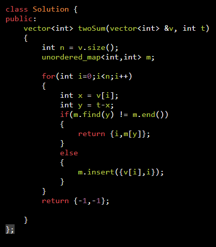
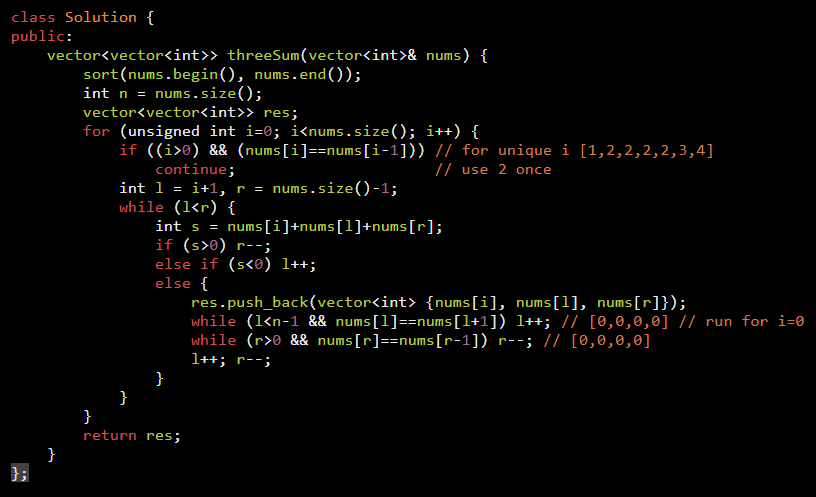
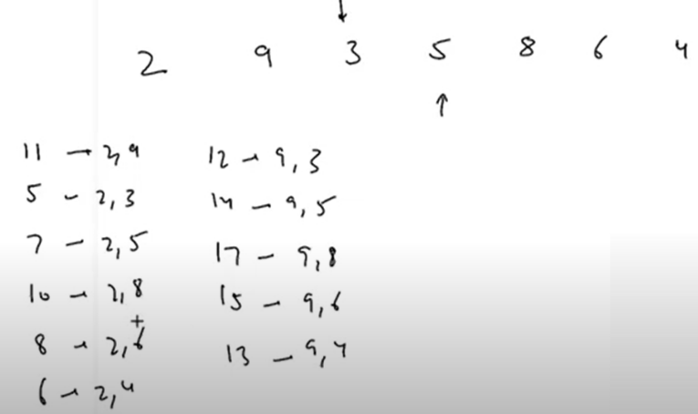
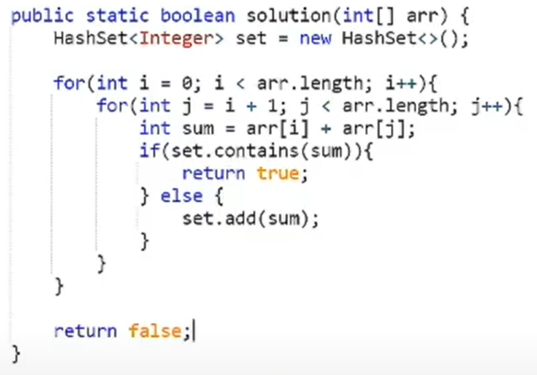

| Problem | Problem |
|----------|----------|
| [1. Two Sum](https://leetcode.com/problems/two-sum/)   | [167. Two Sum II - Input Array Is Sorted](https://leetcode.com/problems/two-sum-ii-input-array-is-sorted/)  |
| [15. 3Sum](https://leetcode.com/problems/3sum/)  Given an integer array `nums`, return all the triplets `[nums[i], nums[j], nums[k]]` such that `i != j`, `i != k`, and `j != k`, and `nums[i] + nums[j] + nums[k] == 0`. Notice that the solution set must not contain duplicate triplets.  **Example 1:** **Input:** nums = [-1,0,1,2,-1,-4] **Output:** [[-1,-1,2],[-1,0,1]] |  |
| [1679. Max Number of K-Sum Pairs](https://leetcode.com/problems/max-number-of-k-sum-pairs/)  **Input:** nums = [1,2,3,4], k = 5 **Output:** 2  Pairs: [1,4], [2,3] |  |
| **2 Pairs with Equal Sum**  To generate unique pairs: `for i = 1 → n-1` `for j = i+1 → n`   |  |
| [1497. Check If Array Pairs Are Divisible by k](https://leetcode.com/problems/check-if-array-pairs-are-divisible-by-k/)  We’re talking about **all pairs**. Number of pairs must be `n / 2` (where `n` is even).  **Example 1:** **Input:** arr = [1,2,3,4,5,10,6,7,8,9], k = 5 **Output:** true **Explanation:** Pairs are (1,9), (2,8), (3,7), (4,6), (5,10).  **Example 2:** **Input:** arr = [1,2,3,4,5,6], k = 7 **Output:** true **Explanation:** Pairs are (1,6), (2,5), (3,4).    ### Remainder Conditions
| rem | condition |
|-----|------------|
| freq(x) rem | equal to freq(k - x) |
| freq(0) rem | even |
| freq(k/2) rem | even | |  |
