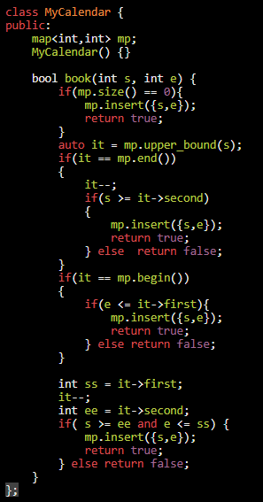

<table>
<colgroup>
<col style="width: 34%" />
<col style="width: 65%" />
</colgroup>
<thead>
<tr class="header">
<th>
<a href="https://leetcode.com/problems/merge-intervals/">56. Merge Intervals</a>

<strong>Input:</strong> intervals = [[1,3],[2,6],[8,10],[15,18]] 
<strong>Output:</strong> [[1,6],[8,10],[15,18]] 
<strong>Explanation:</strong> Since intervals [1,3] and [2,6] overlap, merge them into [1,6].

class Solution {

public:

  vector&lt;vector&lt;int&gt;&gt; merge(vector&lt;vector&lt;int&gt;&gt;&amp; arr) {

    sort(arr.begin(),arr.end());

    vector&lt;vector&lt;int&gt;&gt; ans;

    ans.push_back(arr[0]);

    int n = arr.size();

    for(int i=1;i&lt;n;i++)

    {

      auto curr = arr[i];

      int e = ans.size()-1;

      if(curr[0]&lt;=ans[e][1])

      {

        ans[e] = { min(ans[e][0],curr[0]),

<blockquote>

max(ans[e][1], curr[1]) };

</blockquote>

      }

      else ans.push_back(curr);

    }

    return ans;

  }

};

// curr  0-----

// prev----1

</th>
<th>

</th>
</tr>
</thead>
<tbody>
<tr class="odd">
<td>
<a href="https://leetcode.com/problems/insert-interval/">57. Insert Interval</a>

<strong>Example 1:</strong>

<strong>Input:</strong> intervals = [[1,3],[6,9]], newInterval = [2,5] 
<strong>Output:</strong> [[1,5],[6,9]]

<strong>Example 2:</strong>

<strong>Input:</strong> intervals = [[1,2],[3,5],[6,7],[8,10],[12,16]], newInterval = [4,8] 
<strong>Output:</strong> [[1,2],[3,10],[12,16]] 
<strong>Explanation:</strong> Because the new interval [4,8] overlaps with [3,5],[6,7],[8,10].

</td>
<td>
aclass Solution {

public:

  void insersion(vector&lt;vector&lt;int&gt;&gt; &amp;arr)

  {

    int n = arr.size();

    for(int i = n-1; i&gt;=1 ;i--)

    {

      if(arr[i][0] &lt; arr[i-1][0]) swap(arr[i],arr[i-1]);

      else break;

    }

  }

  vector&lt;vector&lt;int&gt;&gt; insert(vector&lt;vector&lt;int&gt;&gt;&amp; arr, vector&lt;int&gt;&amp; add) {

    arr.push_back(add);

    insersion(arr);

    vector&lt;vector&lt;int&gt;&gt; ans;

    ans.push_back(arr[0]);

    for(int i=1;i&lt; arr.size();i++){

      int e = ans.size()-1;

      if(arr[i][0] &lt;= ans[e][1])

      {

        ans[e] = {min(ans[e][0],arr[i][0]) , max(ans[e][1],arr[i][1])};

      } else ans.push_back(arr[i]);

    }

    return ans;

  }

};

// arr     0------1

// ans   0-----1

</td>
</tr>
<tr class="even">
<td>
Please see and vote for my solutions for similar problems.

<a href="https://leetcode.com/problems/meeting-rooms-ii/discuss/322622/Simple-Python-solutions">253. Meeting Rooms II</a>

<a href="https://leetcode.com/problems/my-calendar-ii/discuss/323479/Simple-C%2B%2B-Solution-using-built-in-map-(Same-as-253.-Meeting-Rooms-II)">731. My Calendar II</a>

<a href="https://leetcode.com/problems/my-calendar-iii/discuss/302492/Simple-C%2B%2B-Solution-using-built-in-map-(Same-as-253.-Meeting-Rooms-II)">732. My Calendar III</a>

<a href="https://leetcode.com/problems/car-pooling/discuss/319088/Simple-Python-solution">1094. Car Pooling</a>

<a href="https://leetcode.com/problems/corporate-flight-bookings/discuss/328949/Simple-Python-solution">1109. Corporate Flight Bookings</a>

<a href="https://leetcode.com/problems/the-skyline-problem/discuss/325070/SImple-Python-solutions">218. The Skyline Problem</a>

</td>
<td><table>
<colgroup>
<col style="width: 44%" />
<col style="width: 55%" />
</colgroup>
<thead>
<tr class="header">
<th>

</th>
<th>

</th>
</tr>
</thead>
<tbody>
</tbody>
</table></td>
</tr>
</tbody>
</table>
