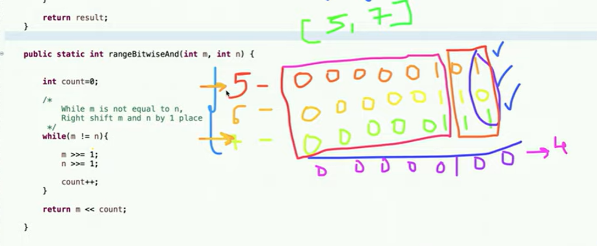

AM

**Tricks**

Always right shift num \>\>= 1;

To check 0th bit num & 1 ( 1 or 0 )

Toggle ^ 1 ( xor 1 \| same 0 diff 1)

extract rmsb num & -num;

off rmsb num & (num -1)

Genrate 0111 (mask\<\<3) - 1

Genrate 1110 in range ((mask\<\<(R-L+1))-1) \<\< (L-1); // (L-1) for shifting

1.  Find right most set bit efficiently =\> make right shift by 1

2.  Find rightmost different bit between 2 numbers

3.  Toggle bits in a given range

int n = 25; // 11001 -\> 10110 // 2 -\> 4

mask need 01110

------------------------

We need 3 one

mask = 00001

mask \<\<= (R - L + 1) = 01000

mask = mask - 1 = 00111

mask \<\<= (L-1) = 01110 yee we achieved what we wanted

// formula for making 111 in between range l-\>r

mask = ((mask\<\<(R-L+1))-1)\<\<(L-1);

4.  right most set bit =\> rmsb = x & -x; // x & (2'c of x)

5.  Off right most set bit =\> x = x & x-1;

6.  Bitwise AND of Numbers Range

--------------------------------------------------------------------------

reason:

// given m \< n

m := common bits + 0 + remaining bits of m

n := common bits + 1 + remaining bits of n which are inverted

delete those bits untill no not equal

// thus repeatedly clear last bit of n, until n \<= m

7.  compliment

