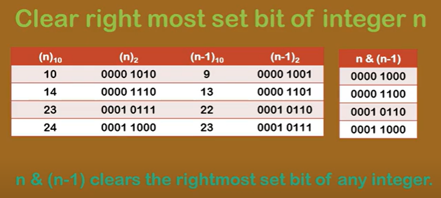

AM

Two formule

Extract rmsb = num & -num num & (2's complement)

SET Off rmsb = num & (num - 1) bcoz it toggle all right bit

including right most set bit

1.  Count no of 1's in binery

int noOfBits(int a) *// 0(N) = O(32)*

{

  int cnt = 0;

  *while* (a)

  {

    *if* (a & 1) cnt++;

    a = a \>\> 1; *// right shift \>\> by 1*

  }

  *return* cnt;

}

Less complexity

*\#include* \<iostream\> *// 0(1)*

using namespace std;

*\#include* \<bits/stdc++.h\>

int main()

{

  int n = 10; *// 1010*

  int cnt = 0;

  *while* (n) {

    n = n & (n - 1);

*// (n-1) toggle rmsb and all right to that bit*

*// in every step we clear rmsb*

    cnt++;

  }

  cout \<\< cnt \<\< endl;

  *return* 0;

}

