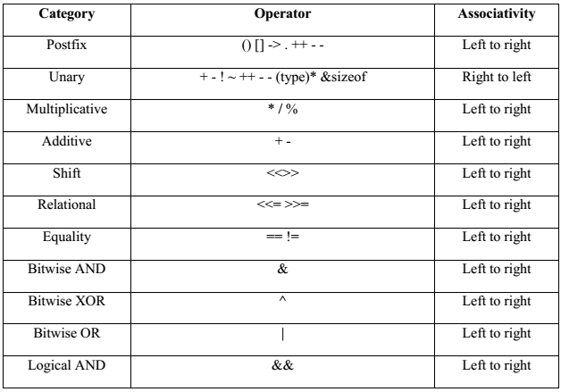
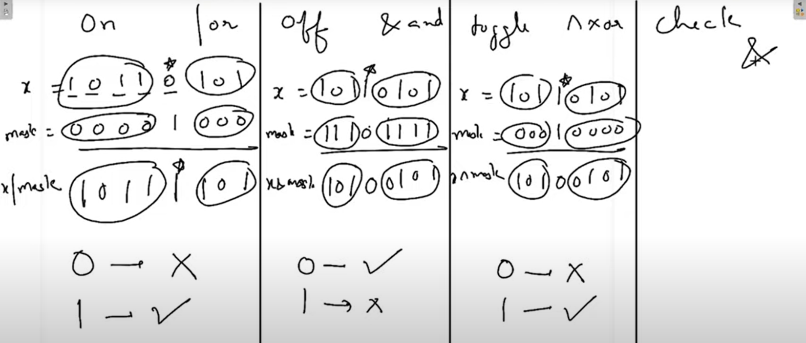
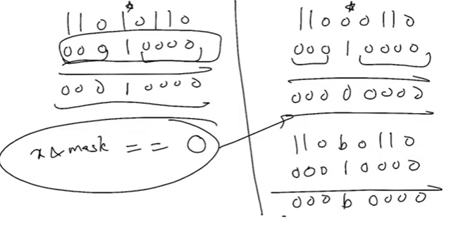
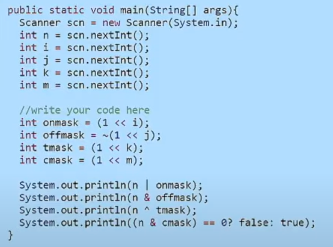

1.  **Trick to Binery**

start dividing & if ans is even then 0 \| if ans is odd then 1

72

72

36

18

9

4

2

1

ans= 1001000

2.  **storage and B2D & D2B**

Machine Decimal Number as Binery & retive B then convert it to D

| DATA TYPE | Range = 2^(n-1) to 2^(n-1)-1 |
|-----------|------------------------------|
| nibble    | 4 bits =\> -8 to 7           |
| byte      | 8 bits                       |
| short     | 16 bits                      |
| int       | 32 bits =\> -2^31 to 2^31-1  |
| long long | 64 bits =\> -2^63 to 2^63-1  |
nibble store 4 bits nibble x = 12 (1100)
stored then cout\<\<x; -\> -4 (1100)

byte x = 12 (0000 1100)
cout\<\<x; -\> 12
as MSB is 0 of x

=================================================================
precedence

6 =\> 6 0110
-7 =\> 1001

0000 0001 0000 0001
shift 3 times shift 4 times
take ~ 1s compliment

Check

