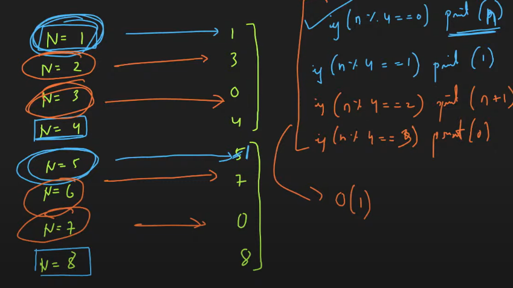
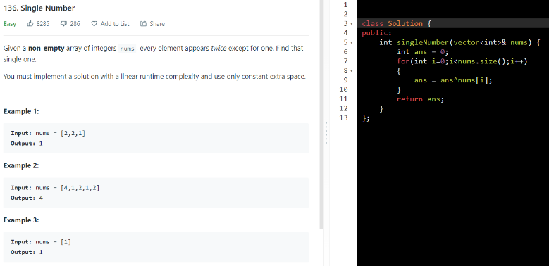
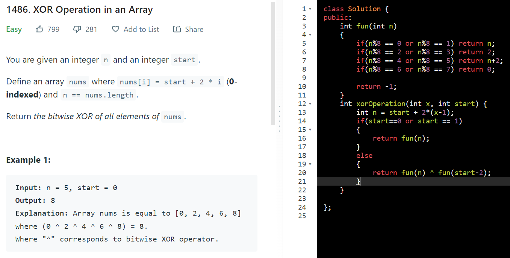
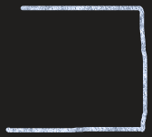

AM

**a^a =\> 0**

**a^0 =\> a**

**XOR -\> same then 0**

**diff then 1**

**USE FOR TOGGLE**

**a^1 = ~a**

**a^0 = a**

1.  **To swap**

2.  **find unique in array**

arr\[\] = {1, 2, 2, 1, 5};

1 ^ 2 ^ 2 ^ 1 ^ 5 ==\> 5

3.  **given n print xor between 1 to n**

If n % 4 = 0, the answer is n.

If n % 4 = 1, the answer is 1.

If n % 4 = 2, the answer is n + 1.

If n % 4 = 3, the answer is 0.

4.  given range print xor bet L & R

ex 3 to 6

ans = xor(6) xor xor(3-1)

1^2^3^4^5^6 xor 1^2

