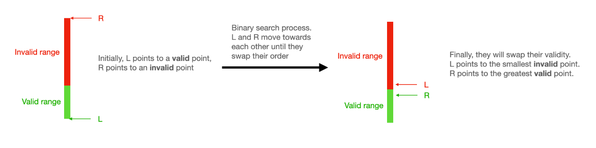
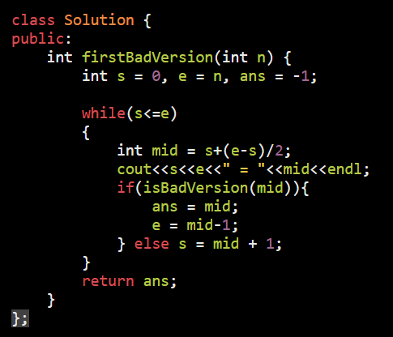
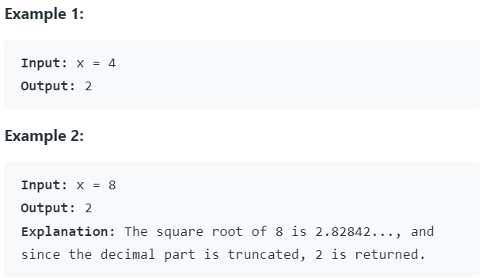
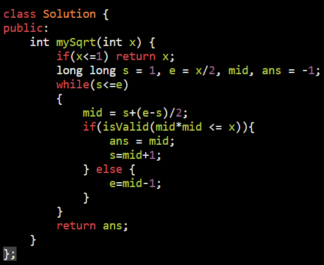
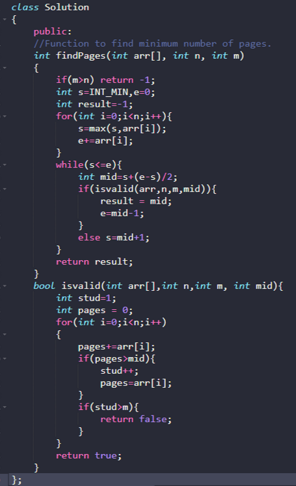

**Identify :**

MINIMUM VALUE IS MAXIMIZE = MINIMUM && MAXIMUM IN SAME QUESION
then it is binery search question

Powerful Template :: [**Link**](https://leetcode.com/problems/first-bad-version/discuss/769685/Python-Clear-explanation-Powerful-Ultimate-Binary-Search-Template.-Solved-many-problems.)

int binery_search(array)
{
  int s = 0, e = arr.size(),ans = -1,mid;
  while (s \<= e)
  {
    mid = s + (e - s) / 2;
    if (isValid(mid))
    {
      ans = mid;
      e = mid - 1;
    }
    else {
      s = mid + 1;
    }
  }
  return ans;
}

bool isValid() {
  conditions..
}

============================================================
<table>
<colgroup>
<col style="width: 50%" />
<col style="width: 50%" />
</colgroup>
<thead>
<tr class="header">
<th>
<a href="https://leetcode.com/problems/first-bad-version/">278. First Bad Version</a>

isBadVersion() -&gt; return version is bad or not

0 1 2 3 4 5

^ ^ ^ ^ ^ ^

F F F F T T

s m e

se = m

05 = 2

35 = 4

33 = 3

</th>
<th>

</th>
</tr>
</thead>
<tbody>
<tr class="odd">
<td>
<a href="https://leetcode.com/problems/peak-index-in-a-mountain-array/https:/leetcode.com/problems/peak-index-in-a-mountain-array/">852. Peak Index in a Mountain Array</a>

<strong>Example 1:</strong>

<strong>Input:</strong> arr = [0,1,0] 
<strong>Output:</strong> 1

<strong>Example 2:</strong>

<strong>Input:</strong> arr = [0,2,1,0] 
<strong>Output:</strong> 1

<strong>Example 3:</strong>

<strong>Input:</strong> arr = [0,10,5,2] 
<strong>Output:</strong> 1
</td>
<td>

</td>
</tr>
<tr class="even">
<td>
<a href="https://leetcode.com/problems/sqrtx/">69. Sqrt(x)</a>

</td>
<td>

</td>
</tr>
<tr class="odd">
<td>
<a href="https://leetcode.com/problems/search-insert-position/">35. Search Insert Position</a>

<strong>Example 1:</strong>

<strong>Input:</strong> nums = [1,3,5,6], target = 5 
<strong>Output:</strong> 2

<strong>Example 2:</strong>

<strong>Input:</strong> nums = [1,3,5,6], target = 2 
<strong>Output:</strong> 1

<strong>Example 3:</strong>

<strong>Input:</strong> nums = [1,3,5,6], target = 7 
<strong>Output:</strong> 4

</td>
<td>

</td>
</tr>
<tr class="even">
<td>
Hard Question Template:

<a href="https://leetcode.com/problems/split-array-largest-sum/">410. Split Array Largest Sum</a>

In this type of Question

Given = arr , m

Aim = create m subarray (contiguous)

return sum = min(sum of all sub array)

</td>
<td>TODO = <a href="https://leetcode.com/discuss/general-discussion/1302335/aggressive-cows-spoj-fully-explained-c">https://leetcode.com/discuss/general-discussion/1302335/aggressive-cows-spoj-fully-explained-c</a></td>
</tr>
<tr class="odd">
<td>
Input:

N = 4

A[] = {12,34,67,90} = 90+34+67+12 = 203/2 =

M = 2

Output:113

Explanation:Allocation can be done in

following ways:

{12} and {34, 67, 90} Maximum Pages = 191

{12, 34} and {67, 90} Maximum Pages = 157

{12, 34, 67} and {90} Maximum Pages = 113

Therefore, the minimum

of these cases is 113, which is selected

as the output.

We have to minimize maximum no of pages allocated per studend

We have to distibute books such that load is almost equally distibuated

We have to distibute books such pages per student should be maximize
</td>
<td>

</td>
</tr>
<tr class="even">
<td><blockquote>

<a href="https://leetcode.com/problems/capacity-to-ship-packages-within-d-days/">1011. Capacity To Ship Packages Within D Days</a>

Debug

1 55 28

Valid

1 27 14

15 27 21

Valid

15 20 17

Valid

15 16 15

Valid

<a href="https://leetcode.com/problems/split-array-largest-sum/discuss/89819/C%2B%2B-Fast-Very-clear-explanation-Clean-Code-Solution-with-Greedy-Algorithm-and-Binary-Search">https://leetcode.com/problems/split-array-largest-sum/discuss/89819/C%2B%2B-Fast-Very-clear-explanation-Clean-Code-Solution-with-Greedy-Algorithm-and-Binary-Search</a>

<a href="https://leetcode.com/problems/koko-eating-bananas/">https://leetcode.com/problems/koko-eating-bananas/</a>

<a href="https://leetcode.com/problems/minimized-maximum-of-products-distributed-to-any-store/">https://leetcode.com/problems/minimized-maximum-of-products-distributed-to-any-store/</a>

</blockquote>
<ul>
<li>
<a href="https://leetcode.com/problems/split-array-largest-sum/">410. Split Array Largest Sum (Hard)</a>
</li>
<li>
<a href="https://leetcode.com/problems/kth-smallest-number-in-multiplication-table/">668. Kth Smallest Number in Multiplication Table (Hard)</a>
</li>
<li>
<a href="https://leetcode.com/problems/maximum-length-of-repeated-subarray/">718. Maximum Length of Repeated Subarray (Medium)</a>
</li>
<li>
<a href="https://leetcode.com/problems/find-k-th-smallest-pair-distance/">719. Find K-th Smallest Pair Distance (Hard)</a>
</li>
<li>
<a href="https://leetcode.com/problems/swim-in-rising-water/">778. Swim in Rising Water (Hard)</a>
</li>
<li>
<a href="https://leetcode.com/problems/longest-duplicate-substring/">1044. Longest Duplicate Substring (Hard)</a>
</li>
<li>
<a href="https://leetcode.com/problems/longest-repeating-substring/">1062. Longest Repeating Substring (Medium)</a>
</li>
<li>
<a href="https://leetcode.com/problems/find-the-smallest-divisor-given-a-threshold/">1283. Find the Smallest Divisor Given a Threshold (Medium)</a>
</li>
<li>
<a href="https://leetcode.com/problems/sum-of-mutated-array-closest-to-target/">1300. Sum of Mutated Array Closest to Target (Medium)</a>
</li>
<li>
<a href="https://leetcode.com/problems/minimum-number-of-days-to-make-m-bouquets/">1482. Minimum Number of Days to Make m Bouquets (Medium)</a>
</li>
<li>
<a href="https://leetcode.com/problems/sell-diminishing-valued-colored-balls/">1648. Sell Diminishing-Valued Colored Balls (Medium)</a>
</li>
<li>
<a href="https://leetcode.com/problems/maximum-value-at-a-given-index-in-a-bounded-array/">1802. Maximum Value at a Given Index in a Bounded Array (Medium)</a>
</li>
<li>
<a href="https://leetcode.com/problems/minimum-speed-to-arrive-on-time/">1870. Minimum Speed to Arrive on Time (Medium)</a>
</li>
</ul>
<blockquote>

<a href="https://leetcode.com/problems/kth-smallest-element-in-a-sorted-matrix/">https://leetcode.com/problems/kth-smallest-element-in-a-sorted-matrix/</a>

</blockquote></td>
<td>

</td>
</tr>
</tbody>
</table>
