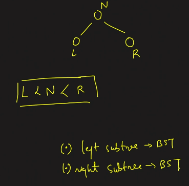

1.  All left \< root-\>val
All right \> root-\>val

root-\>left-\>val \< root-\>left-\>right-\>val \< root-\>val

======================================================================

Dublicate in BST some book say allow

1.  use conditon L\<=N\<R
2.  maintain freq {node, int freq}

In Height is always take as log(n) with base 2
