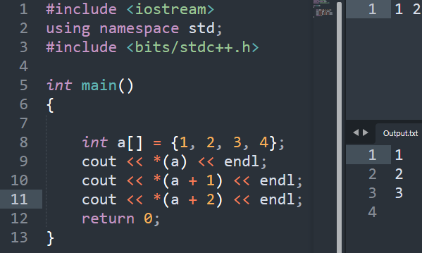

IN a\[5\]
1.  value = a\[i\] or \*(a+i) both same
2.  address = &a\[i\] or (a+i) both same

1.  Array as Fun Arguments

int fun(int a\[\]) // int \*a similar to a\[\]

2.  create dynamic array in c++

int main()

{

int size;

std::cin \>\> size;

int \*array = new int\[size\];

delete \[\] array;

return 0;

}

