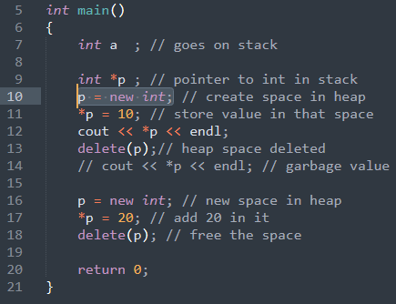
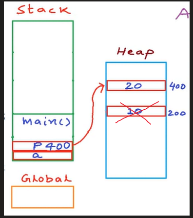

AM

Allocation = new keyword

Deallocation = delete keyword

1.  single varibale

2.  contigious allocation

==Memory Leak :==

In lang like jave garbage is atomatically cleard from heap

But in c/cpp we have to clear it by ourself

else we are wasting memory

==Dangling Pointer :==

A pointer pointing to a memory location that has been deleted (or freed)

int \*p = new int; // request memory

\*p = 5; // store value

delete p; // free up the memory

// now p is a dangling pointer

