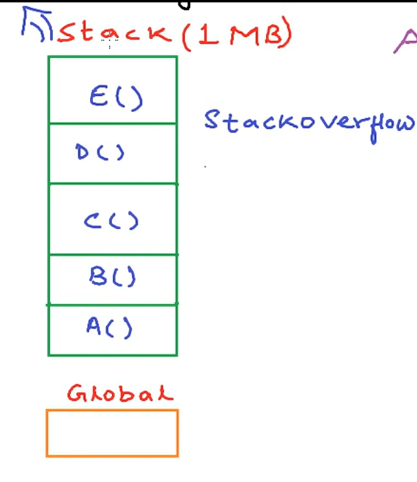

AM

<table>
<colgroup>
<col style="width: 53%" />
<col style="width: 46%" />
</colgroup>
<thead>
<tr class="header">
<th>stack</th>
<th>Heap</th>
</tr>
</thead>
<tbody>
<tr class="odd">
<td>stack is used for static memory allocation</td>
<td>Heap is used for dynamic memory allocation</td>
</tr>
<tr class="even">
<td>
When the fun A calls another fun B the fun A pause and wait till fun B exicute.

every time a function exits, all the variables transferred to the stack by that function are deleted
</td>
<td></td>
</tr>
<tr class="odd">
<td>you do not have to <mark>manage</mark> the memory. Memory is allocated automatically</td>
<td>We have to take care memory allocation and deallocation</td>
</tr>
<tr class="even">
<td>object created in stack are not golabally accessable</td>
<td>Object stored in heap are golabally accessable</td>
</tr>
<tr class="odd">
<td>
Stack contain refrence to the object created in heap

int *p = new int();
</td>
<td></td>
</tr>
<tr class="even">
<td>When stack is full -&gt; StackOverFlowError</td>
<td>When heap is full -&gt; OutOfMemoryError</td>
</tr>
</tbody>
</table>

