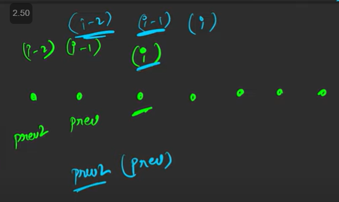
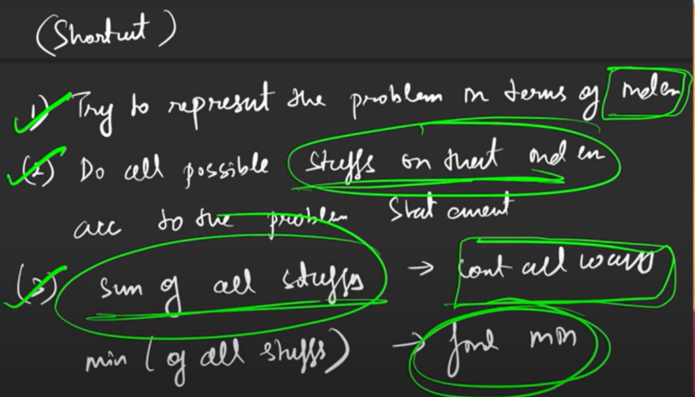

DP SOLVE BY

Tabulation --\> bottom up

Memoization --\> top-down

Memoization --\> top-down

tc sc tc sc then space optimization

============================================================

Example fibo no.

fibo (5) recursion tree it took 0(2^n)

Overlapping sub problem == when we tends to solve sub problem again use DP

i.e do memoization = we store the value of sub problem in some map or table

where n = no. of sub problem

step to convert recursion --\> dp
1.  declare dp array
2.  store values for every sub-problem
3.  return if curr prob is previously solved

int fibo(int n) *// Normal recursion*
{
  if(n\<=1) return n;
  return fibo(n-1) + fibo(n-2);
}

int fibo_dp(int n,vector\<int\> &dp)
{
  if(n\<=1) return n;
  if(dp\[n\]!=-1) return dp\[n\]; *// (3) return if previously solved*
  return dp\[n\] = fibo_dp(n-1,dp) + fibo_dp(n-2,dp); *// (2)store values*
}

int main() {
  int n = 5 ;
  vector\<int\> dp(n+1,-1); *// (1) declear dp*
  cout\<\<fibo_dp(n,dp);
}

TC =\> O(n)
SC =\> O(n) stack space + O(n) dp array

How to convert recursion to tabulation

int fibo_tab(int n)
{
  vector\<int\> dp(n+1,-1);
  dp\[0\] = 0; dp\[1\] = 1;
  for(int i=2;i\<=n;i++){
    dp\[i\]=dp\[i-1\]+dp\[i-2\];
  }
  return dp\[n\];
}

TC =\> O(n)
SC =\> O(n) dp array

More space optimized

TC =\> O(n)
SC =\> O(1)

int fibo_final(int n)
{
  int prev2 = 0;
  int prev = 1;
  for(int i=2;i\<=n;i++)
  {
    int curi=prev+prev2;
    prev2 = prev;
    prev = curi;
  }
  return prev;
}

======================================================
How to know DP problem
------------------------------------------
count the no. of ways

Or

Min Max output

Recursion = All possible ways asked

Shortcut =
1.  Try to represent the problem in term of index
2.  Do all possible stuff on that index acc to prob stet
3.  sum of alll stuff --\> min (all stuff)

=======================================================

**Aditya Varma**
DP = Enhansed Recursion

**Choice included** ----\> We need Recursion

Included or not, take or not,

**Recursion ---\> 2 calls \|\|** Repeating sub problem

**Optimal Asked 100% DP**

Do Recursion --\> Memoization ( 2 sentence add \| top - down)
--\> bottom- up

=======================================================

Recursion =\> 0(2^n) or 0(n!) --\> conveted to 0(n) or 0(2^n)
exponential conv to linear
factorial conv to exponential

