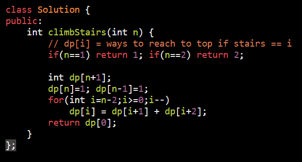
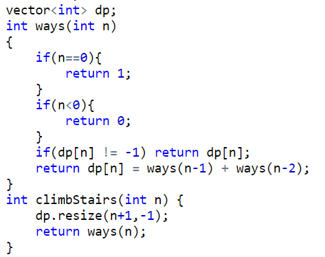

AM

<table>
<colgroup>
<col style="width: 42%" />
<col style="width: 57%" />
</colgroup>
<thead>
<tr class="header">
<th>
<a href="https://leetcode.com/problems/climbing-stairs/">70. Climbing Stairs</a>

<table>
<colgroup>
<col style="width: 21%" />
<col style="width: 21%" />
<col style="width: 21%" />
<col style="width: 21%" />
<col style="width: 15%" />
</colgroup>
<thead>
<tr class="header">
<th>X</th>
<th>1</th>
<th>2</th>
<th>3</th>
<th>5</th>
</tr>
</thead>
<tbody>
</tbody>
</table></th>
<th>

</th>
</tr>
</thead>
<tbody>
<tr class="odd">
<td></td>
<td></td>
</tr>
<tr class="even">
<td>
<a href="https://leetcode.com/problems/house-robber/submissions/">198. House Robber</a>

if 1 house

if 2 house will rob max one

for any house : choice :

Rob : arr[i] + rob(till i-2)

not rob : rob(till i-1)

max(Rob,not rob)

<table>
<colgroup>
<col style="width: 21%" />
<col style="width: 21%" />
<col style="width: 21%" />
<col style="width: 21%" />
<col style="width: 15%" />
</colgroup>
<thead>
<tr class="header">
<th>7</th>
<th>2</th>
<th>9</th>
<th>3</th>
<th>1</th>
</tr>
</thead>
<tbody>
<tr class="odd">
<td>7</td>
<td>7</td>
<td>16</td>
<td>16</td>
<td>17</td>
</tr>
</tbody>
</table></td>
<td>

dp[i] = robbery till house i

</td>
</tr>
</tbody>
</table>
