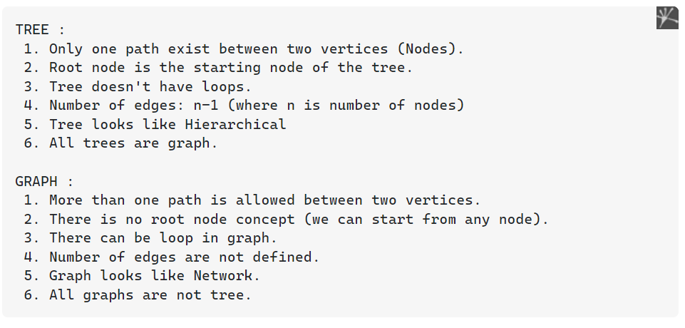
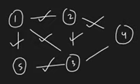
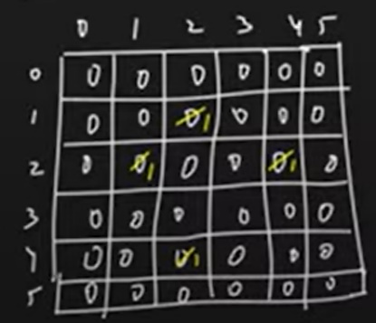
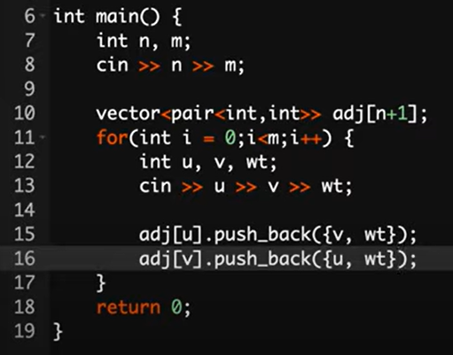
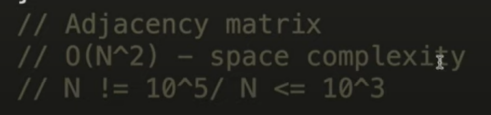
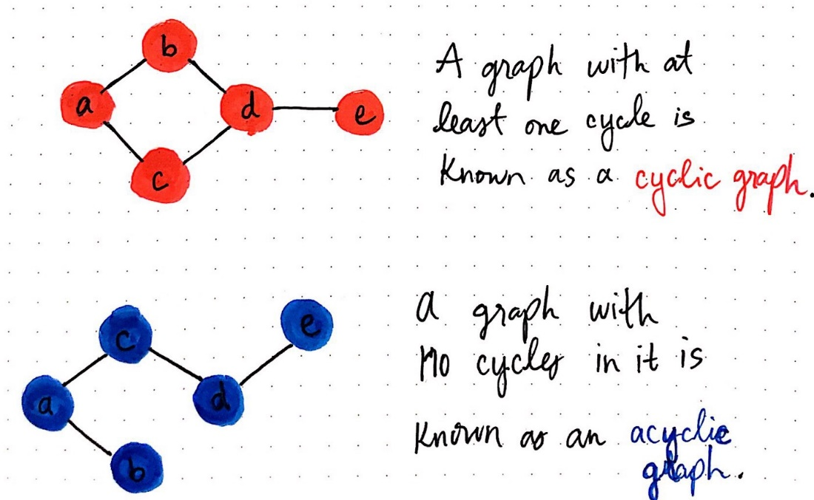

AM
Tree Vs Graph
- Graph With no cycle is tree
- Tree edges = n - 1 Graph edges \> n - 1
- Every Tree is graph

<table>
<colgroup>
<col style="width: 42%" />
<col style="width: 57%" />
</colgroup>
<thead>
<tr class="header">
<th>Tree</th>
<th>Graph</th>
</tr>
</thead>
<tbody>
<tr class="odd">
<td>exactly n - 1 edges</td>
<td>max edges: n to n*(n-1)/2</td>
</tr>
<tr class="even">
<td>no cycle</td>
<td>cycle present</td>
</tr>
<tr class="odd">
<td>directed -&gt;</td>
<td>undirected, directed</td>
</tr>
<tr class="even">
<td>
class node {

int data;

<blockquote>

node* left;

node* right;

</blockquote>

}
</td>
<td>
vector&lt;vector&lt;int&gt;&gt; adj; 
vector&lt;int&gt; adj[]; 
 
unordered_map&lt;int,

vector&lt; pair&lt;int,int&gt; &gt; &gt; um;
</td>
</tr>
</tbody>
</table>

Example
Tree = Folder stracture
Graph = Facebook Friend

--------------------------------------------------------------
| Graph        | Undirected          | directed                       |
|--------------|---------------------|--------------------------------|
| max Edge (e) | n\*(n-1)/2          | n\*(n-1)                       |
| sum of edge  | 2\*e                | sum(in) = sum(out) = e         |
| degree       | degree for directed | in & out degree for undirected |

--------------------------------------------------------------
Types of Graph ( Cyclic Acyclic Weighted )

--------------------------------------------------------------
Connected component -
If we can reach to any node from any other node then they are component

--------------------------------------------------------------
Representation of this Graph :

<table>
<colgroup>
<col style="width: 51%" />
<col style="width: 48%" />
</colgroup>
<thead>
<tr class="header">
<th>
Adjecency matrix

graph[n+1][n+1] // n = no. of vertex

use hastable if vertex name in graph

= abc, bcd
</th>
<th>

</th>
</tr>
</thead>
<tbody>
<tr class="odd">
<td>
Adjecency List

vector&lt;int&gt; adj[n+1]

vector&lt;vector&lt;int&gt;&gt; adj(n+1);

vector&lt;pair&lt;int,int&gt;&gt; graph[n+1]

vertex,weight

</td>
<td>
Weight wt

</td>
</tr>
</tbody>
</table>

<table>
<colgroup>
<col style="width: 27%" />
<col style="width: 19%" />
<col style="width: 52%" />
</colgroup>
<thead>
<tr class="header">
<th>Time Complexity</th>
<th>Matrix</th>
<th>
List

vector&lt;pair&lt;int,int&gt;&gt; graph[n+1]
</th>
</tr>
</thead>
<tbody>
<tr class="odd">
<td>SC</td>
<td>V*V</td>
<td>V+E</td>
</tr>
<tr class="even">
<td>TC check edge</td>
<td>1</td>
<td>V i.e E more accurate but say V</td>
</tr>
<tr class="odd">
<td>TC check vertex adjecent to u</td>
<td>V</td>
<td>V i.e E 
</td>
</tr>
<tr class="even">
<td>Remove</td>
<td>1</td>
<td>V</td>
</tr>
</tbody>
</table>

\> m = edges = 2\*e (undireced)

1.  node = u,v
edge = {u,v} = pair of nodes

2.  undirected graph :

directed graph :

3.  connected component : on every vertex we can go to another vertiex

3 connected comp

in directed graph there is strongly

strongly connected comp

