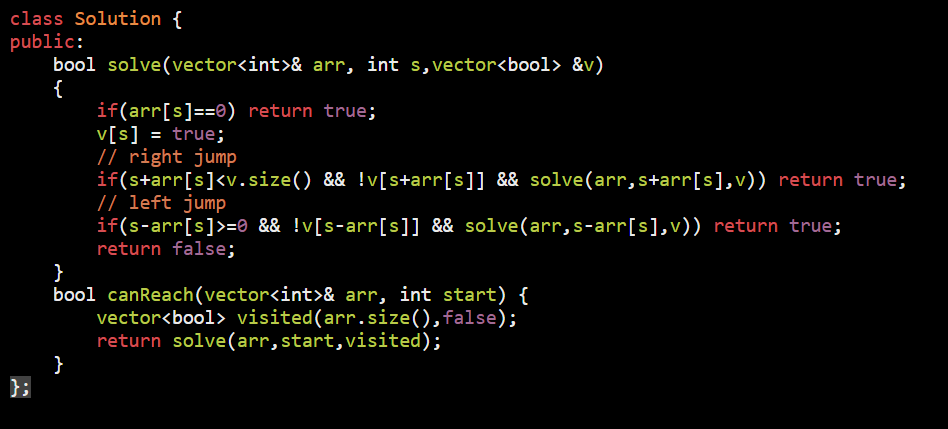

AM

<table>
<colgroup>
<col style="width: 23%" />
<col style="width: 76%" />
</colgroup>
<thead>
<tr class="header">
<th>
<a href="https://leetcode.com/problems/jump-game/">55. Jump Game</a>

Input: nums = [2,3,1,1,4]

Output: true

Explanation: Jump 1 step from index 0 to 1, then 3 steps to the last index.

Input: nums = [3,2,1,0,4]

Output: false

Explanation: You will always arrive at index 3 no matter what. Its maximum jump length is 0, which makes it impossible to reach the last index.
</th>
<th>

</th>
</tr>
</thead>
<tbody>
<tr class="odd">
<td>
<a href="https://leetcode.com/problems/jump-game-ii/https:/leetcode.com/problems/jump-game-ii/">45. Jump Game II</a> <a href="https://youtu.be/A-Mc_0WsoaM">Video</a>

from i==0 can reach to 2 which cnt as J1

so till 2 i will track my max reach for J2

<table>
<colgroup>
<col style="width: 20%" />
<col style="width: 20%" />
<col style="width: 20%" />
<col style="width: 20%" />
<col style="width: 17%" />
</colgroup>
<thead>
<tr class="header">
<th>2</th>
<th>3</th>
<th>1</th>
<th>1</th>
<th>4</th>
</tr>
</thead>
<tbody>
</tbody>
</table>

|------J1------|----J2---|

<strong>Example 1:</strong>

<strong>Input:</strong> nums = [2,3,1,1,4] 
<strong>Output:</strong> 2 
<strong>Explanation:</strong> The minimum number of jumps to reach the last index is 2. Jump 1 step from index 0 to 1, then 3 steps to the last index.

<strong>Example 2:</strong>

<strong>Input:</strong> nums = [2,3,0,1,4] 
<strong>Output:</strong> 2

</td>
<td>

</td>
</tr>
<tr class="even">
<td>
<a href="https://leetcode.com/problems/jump-game-iii/">1306. Jump Game III</a> Use DFS

<strong>Example 1:</strong>

<strong>Input:</strong> arr = [4,2,3,0,3,1,2], start = 5 
<strong>Output:</strong> true 
<strong>Explanation:</strong> 
All possible ways to reach at index 3 with value 0 are: 
index 5 -&gt; index 4 -&gt; index 1 -&gt; index 3 
index 5 -&gt; index 6 -&gt; index 4 -&gt; index 1 -&gt; index 3

<strong>Input:</strong> arr = [3,0,2,1,2], start = 2 
<strong>Output:</strong> false 
<strong>Explanation:</strong> There is no way to reach at index 1 with value 0.

</td>
<td>

</td>
</tr>
</tbody>
</table>
