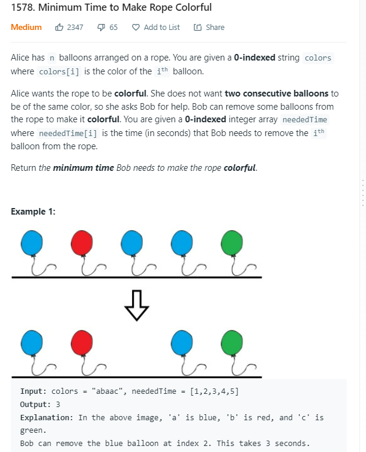

AM

<table>
<colgroup>
<col style="width: 52%" />
<col style="width: 47%" />
</colgroup>
<thead>
<tr class="header">
<th>
<a href="https://leetcode.com/problems/minimum-time-to-make-rope-colorful/">1578. Minimum Time to Make Rope Colorful</a>

</th>
<th>

</th>
</tr>
</thead>
<tbody>
<tr class="odd">
<td></td>
<td></td>
</tr>
</tbody>
</table>
