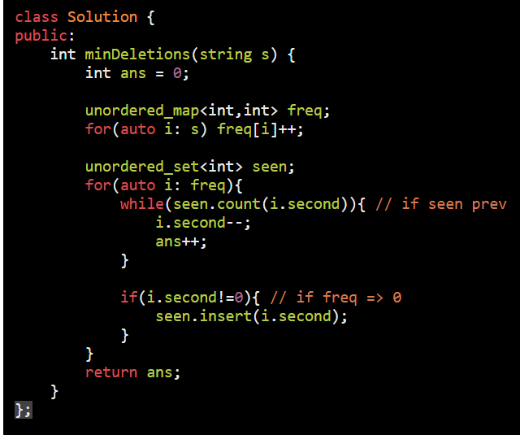

AM

==minimum decrement to make array element unique==

[1647. Minimum Deletions to Make Character Frequencies Unique](https://leetcode.com/problems/minimum-deletions-to-make-character-frequencies-unique/)

More better soluation is also avaliable :
