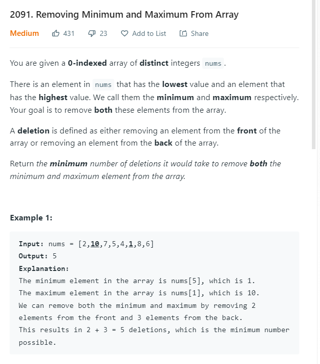

AM

<table>
<colgroup>
<col style="width: 48%" />
<col style="width: 51%" />
</colgroup>
<thead>
<tr class="header">
<th>
<a href="https://leetcode.com/problems/removing-minimum-and-maximum-from-array/">2091. Removing Minimum and Maximum From Array</a>

</th>
<th>

</th>
</tr>
</thead>
<tbody>
<tr class="odd">
<td></td>
<td></td>
</tr>
</tbody>
</table>

