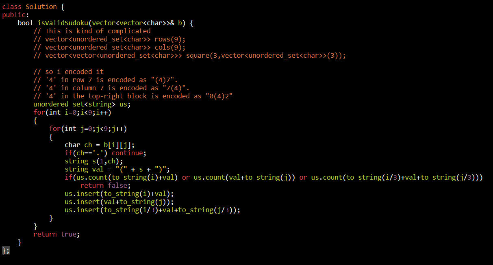

<table>
<colgroup>
<col style="width: 37%" />
<col style="width: 62%" />
</colgroup>
<thead>
<tr class="header">
<th>
<a href="https://leetcode.com/problems/valid-sudoku/">36. Valid Sudoku</a>

<strong>Input:</strong> board = 
[["8","3",".",".","7",".",".",".","."] 
,["6",".",".","1","9","5",".",".","."] 
,[".","9","8",".",".",".",".","6","."] 
,["8",".",".",".","6",".",".",".","3"] 
,["4",".",".","8",".","3",".",".","1"] 
,["7",".",".",".","2",".",".",".","6"] 
,[".","6",".",".",".",".","2","8","."] 
,[".",".",".","4","1","9",".",".","5"] 
,[".",".",".",".","8",".",".","7","9"]] 
<strong>Output:</strong> false 
<strong>Explanation:</strong> Same as Example 1, except with the <strong>5</strong> in the top left corner being modified to <strong>8</strong>. Since there are two 8's in the top left 3x3 sub-box, it is invalid.

</th>
<th>

</th>
</tr>
</thead>
<tbody>
</tbody>
</table>
