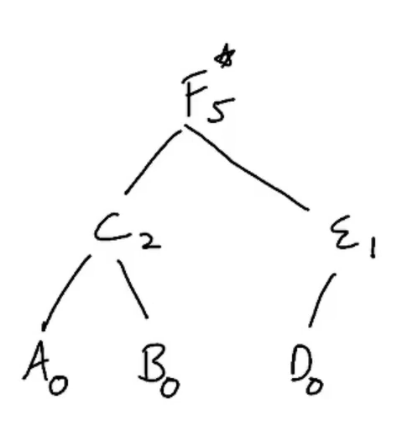

vector\<pair\<char, char\>\> vp = {
{'A', 'C'}, {'B', 'C'}, {'C', 'F'},

{'D', 'E'}, {'E', 'F'}, {'F', 'F'}
};

// 'A' is reporting to 'C' similearly all
// find

// Ans
Tree
E-\>D
C-\>B A
F-\>E C

A 0
B 0
C 2
D 0
F 5
E 1

*\#include* \<iostream\>
using namespace std;
*\#include* \<bits/stdc++.h\>
unordered_map\<char, int\> ans;
void helper(unordered_map\<char, unordered_set\<char\>\> &tree, char root)
{
  *if* (!tree.count(root)) {
    ans.insert({root, 0});
    *return*;
  }
  ans.insert({root, 0});
  *for* (auto &emp : tree\[root\]) {
    helper(tree, emp);
    ans\[root\] += ans\[emp\] + 1;
  }
}
int helper2(unordered_map\<char, unordered_set\<char\>\> &tree, char root)
{
  *if* (!tree.count(root)) {
    ans.insert({root, 0});
    *return* 0;
  }
  int underEmployee = 0;
  *for* (auto &emp : tree\[root\]) {
    underEmployee += helper2(tree, emp);
    underEmployee += 1;
  }
  ans.insert({root, underEmployee});
  *return* underEmployee;
}
void solve(vector\<pair\<char, char\>\> &vp)
{
*  // um of maneger and employee..*
  unordered_map\<char, unordered_set\<char\>\> tree;
  char ceo ;
  *for* (auto &i : vp)
  {
    *if* (i.first == i.second) {
      ceo = i.first;
      *continue*;
    }
    tree\[i.second\].insert(i.first);
  }
  cout \<\< "Tree " \<\< endl;
  *for* (auto i : tree) {
    cout \<\< i.first \<\< "-\>";
    *for* (auto j : i.second) {
      cout \<\< j \<\< " ";
    }
    cout \<\< endl;
  }
  cout \<\< endl;
  helper(tree, ceo);
  *for* (auto i : ans) {
    cout \<\< i.first \<\< " " \<\< i.second \<\< endl;
  }
}
int main()
{
  vector\<pair\<char, char\>\> vp = {
    {'A', 'C'}, {'B', 'C'}, {'C', 'F'},
    {'D', 'E'}, {'E', 'F'}, {'F', 'F'}
  };
  solve(vp);
  *return* 0;
}

