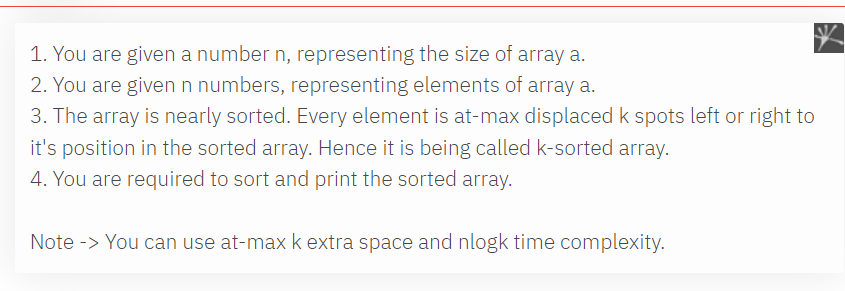

AM

sol 1 = sort function nlogn
sol 2 = insersion sort + sliding window n\*k
sol 3 = heap + sliding window = nlog(k) // best

*\#include* \<iostream\>
using namespace std;
*\#include* \<bits/stdc++.h\>
void sortK(vector\<int\> &arr, int k)
{
  int n = arr.size();
  k = k + 1; *// window size*
  priority_queue\<int, vector\<int\>\> pq;
  *for* (int i = 0; i \< k; i++) pq.push(-arr\[i\]);
  *for* (int i = k; i \< n; i++) {
    arr\[i - k\] = -pq.top(); pq.pop();
    pq.push(-arr\[i\]);
  }
  int e = n - k;
  *while* (!pq.empty()) {
    arr\[e++\] = -pq.top(); pq.pop();
  }
  *for* (auto i : arr) cout \<\< i \<\< " ";
}
void insersionSort(vector\<int\> arr, int k)
{
  int n = arr.size();
  *for* (int i = 1; i \< n; i++) *// n time*
  {
    int j = i;
    *while* (j \>= 1 and arr\[j - 1\] \> arr\[j\]) *// will loop max k time*
    {
      swap(arr\[j - 1\], arr\[j\]);
      j--;
    }
  }
  *for* (auto i : arr) cout \<\< i \<\< " ";
  cout \<\< endl;
}
int main()
{
  vector\<int\> arr = {2, 3, 1, 4, 6, 7, 5, 8, 9};
  insersionSort(arr, 2);
  sortK(arr, 2);
  *return* 0;
}

1 2 3 4 5 6 7 8 9
pop 1 push 4
pop 2 push 6
pop 3 push 7
pop 4 push 5
pop 5 push 8
pop 6 push 9
1 2 3 4 5 6 7 8 9

