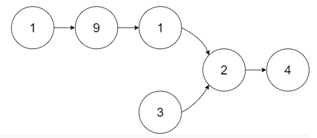

Find How much extra element bigger list has
move head by that much node

class Solution {

public:

ListNode \*getIntersectionNode(ListNode \*headA, ListNode \*headB) {

ListNode \*a = headA, \*b = headB;

while (a != b) {

a = !a ? headB : a-\>next;

b = !b ? headA : b-\>next;

}

return a;

}

};
