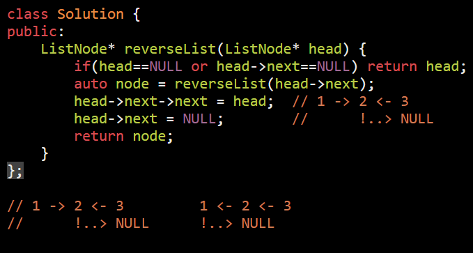
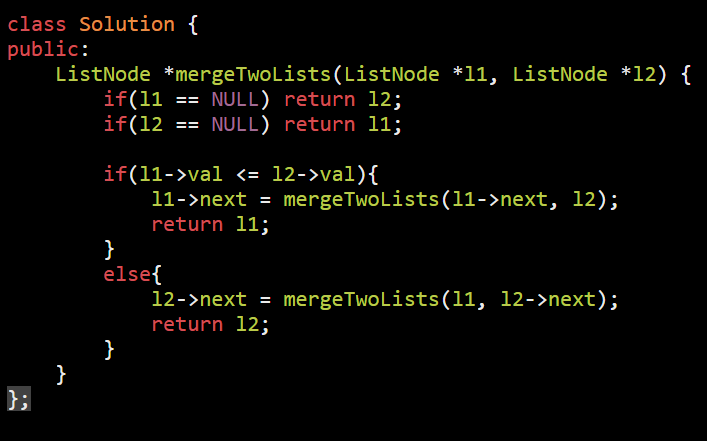
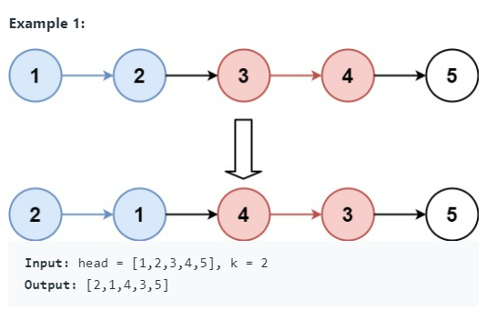
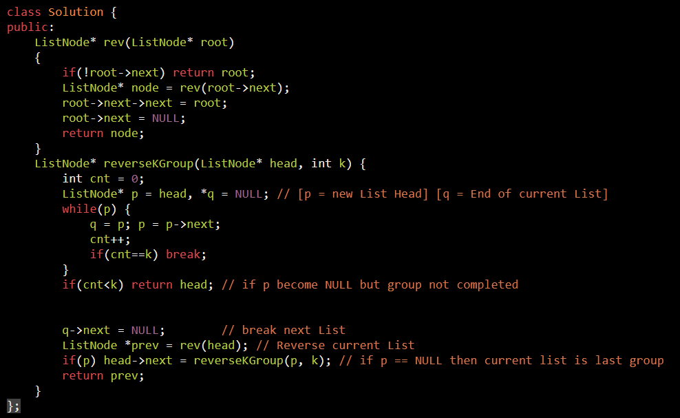

AM

<table>
<colgroup>
<col style="width: 43%" />
<col style="width: 56%" />
</colgroup>
<thead>
<tr class="header">
<th>
<a href="https://leetcode.com/problems/reverse-linked-list/submissions/">206. Reverse Linked List</a>

1 -&gt; 2 -&gt; 3 -&gt; null

3 -&gt; 2 -&gt; 1 -&gt; null

</th>
<th>

</th>
</tr>
</thead>
<tbody>
<tr class="odd">
<td>
<a href="https://leetcode.com/problems/merge-two-sorted-lists/">21. Merge Two Sorted Lists</a>

</td>
<td>

</td>
</tr>
<tr class="even">
<td>
<a href="https://leetcode.com/problems/reverse-nodes-in-k-group/">25. Reverse Nodes in k-Group</a>

</td>
<td>

</td>
</tr>
</tbody>
</table>

