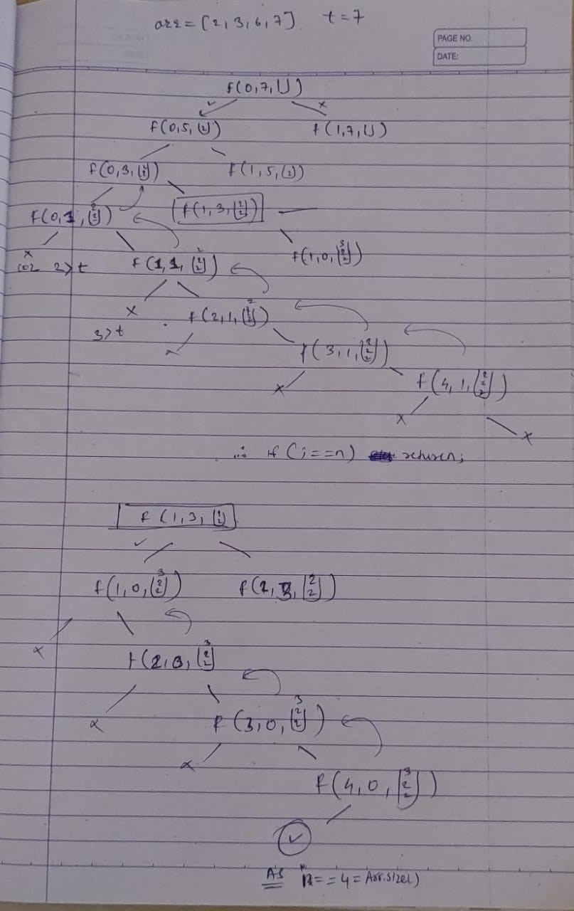
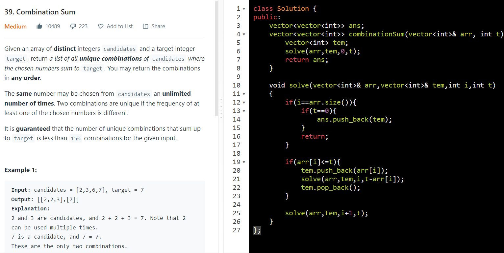

AM

1.  Combination sum / subset sum

1.  every element can be taken multiple times
2.  all are distict

choices

multiple take not take

untill t==0 or

arr\[i\]\<t

TC = tell first exponential = 2^k

SC = O(length_of_longest_combination).

<https://leetcode.com/problems/combination-sum/discuss/1755084/Detailed-Time-and-Space-Complecity-analysisc%2B%2Bjavabacktracking>

============================================

