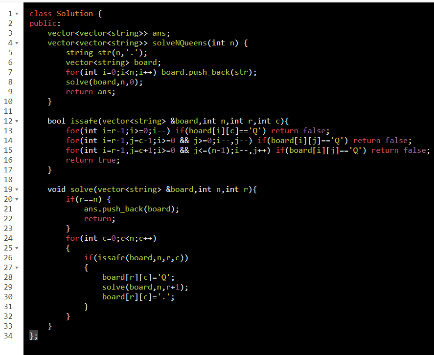
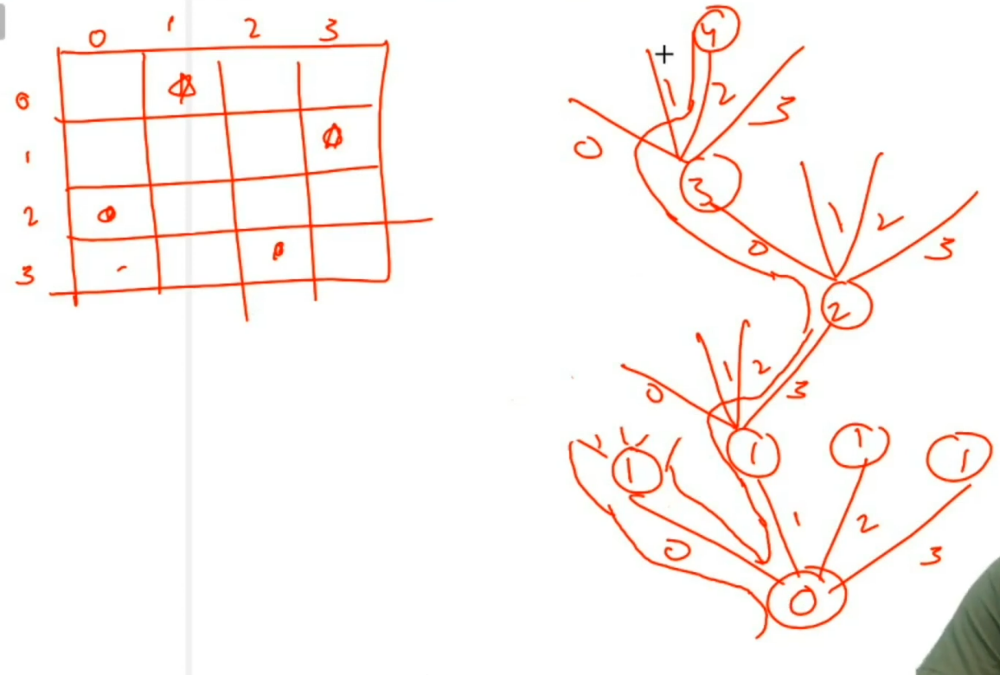

[51.N-Queens](https://leetcode.com/problems/n-queens/)

ON level = row
options = col

=============================================

*\#include* \<iostream\>
using namespace std;
*\#include* \<bits/stdc++.h\>
*// row1 then row2*
bool isSafe(vector\<vector\<char\>\> &board, int row, int col)
{
*  // checking up*
  *for* (int i = row - 1; i \>= 0; i--)
if (board\[i\]\[col\] == 'Q') return false;
*  // checking digonally left*
  *for* (int i = row - 1, j = col - 1; i \>= 0 && j \>= 0; i--, j--)
if (board\[i\]\[j\] == 'Q') return false;
*  // checking digonally right*
  *for* (int i = row - 1, j = col + 1; i \>= 0 && j \<= board\[0\].size() - 1; i--, j++)
if (board\[i\]\[j\] == 'Q') return false;
  *return* true;
}

void nqueen(vector\<vector\<char\>\> &board, int row) // triverse on row
{
  *if* (row == board.size()) {
    *for* (auto && i : board)
    {
      *for* (auto && j : i) cout \<\< j \<\< " ";
      cout \<\< endl;
    }
    cout \<\< endl;
    *return*;
  }
  *for* (int i = 0; i \< board\[0\].size(); i++) // triverse on column
  {
    *if* (isSafe(board, row, i)) {
      board\[row\]\[i\] = 'Q';
      nqueen(board, row + 1);
      board\[row\]\[i\] = '\*';
    }
  }
}

int main()
{
  int row, col;
  row = col = 4;
  vector\<vector\<char\>\> board(row, vector\<char\> (col, '\*'));
  *for* (auto && i : board)
  {
    *for* (auto && j : i) cout \<\< j \<\< " ";
    cout \<\< endl;
  }
  cout \<\< "=====" \<\< endl;
  string psf = "";
  nqueen(board, 0);
  *return* 0;
}

