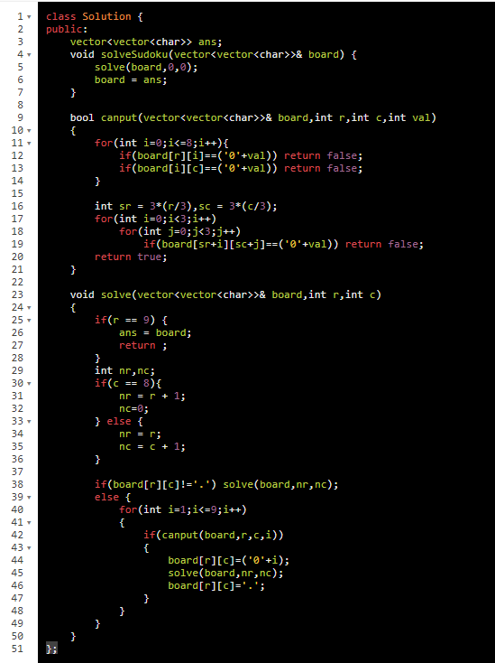

AM

[37. Sudoku Solver](https://leetcode.com/problems/sudoku-solver/)

How to make it inplace :

*\#include* \<iostream\>
using namespace std;
*\#include* \<bits/stdc++.h\>
bool canfill(vector\<vector\<int\>\> &board, int row, int col, int val)
{
  *for* (int i = 0; i \<= 8; i++)
    *if* (board\[row\]\[i\] == val)
      *return* false;
  *for* (int i = 0; i \<= 8; i++)
    *if* (board\[i\]\[col\] == val)
      *return* false;
  int sm_row = 3 \* (row / 3), sm_col = 3 \* (col / 3);
  *for* (int i = 0; i \< 3; i++)
    *for* (int j = 0; j \< 3; j++)
      *if* (board\[sm_row + i\]\[sm_col + j\] == val)
        *return* false;
  *return* true;
}
void printboard(vector\<vector\<int\>\> &board)
{
  *for* (auto && i : board)
  {
    *for* (auto && j : i) cout \<\< j \<\< " ";
    cout \<\< endl;
  }
  cout \<\< endl;
}
bool sudukuSolver2(vector\<vector\<int\>\> &board, int row, int col)
{
  *if* (row == 9) {
*    // printboard(board);*
    *return* true;
  }
  int new_row, new_col;
  *if* (col == 8) {
    new_row = row + 1;
    new_col = 0;
  } *else* {
    new_col = col + 1;
    new_row = row;
  }
  *if* (board\[row\]\[col\] != 0) {
    *return* sudukuSolver2(board, new_row, new_col);
  } *else* {
    *for* (int val = 1; val \<= 9; val++)
    {
      *if* (canfill(board, row, col, val)) {
        board\[row\]\[col\] = val;
        *if* (sudukuSolver2(board, new_row, new_col)) *return* true;
        board\[row\]\[col\] = 0;
      }
    }
  }
  *return* false;
}
void ss(vector\<vector\<int\>\> &board, int row, int col)
{
  *if* (row == 9) {
    printboard(board);
    *return*;
  }
  int new_row, new_col;
  *if* (col == 8) {
    new_row = row + 1;
    new_col = 0;
  } *else* {
    new_col = col + 1;
    new_row = row;
  }
  *if* (board\[row\]\[col\] != 0) {
    ss(board, new_row, new_col);
  } *else* {
    *for* (int val = 1; val \<= 9; val++)
    {
      *if* (canfill(board, row, col, val)) {
        board\[row\]\[col\] = val;
        ss(board, new_row, new_col);
        board\[row\]\[col\] = 0;
      }
    }
  }
}
int main()
{
  vector\<vector\<int\>\> board =
  {
    {3, 0, 6, 5, 0, 8, 4, 0, 0,},
    {5, 2, 0, 0, 0, 0, 0, 0, 0,},
    {0, 8, 7, 0, 0, 0, 0, 3, 1,},
    {0, 0, 3, 0, 1, 0, 0, 8, 0,},
    {9, 0, 0, 8, 6, 3, 0, 0, 5,},
    {0, 5, 0, 0, 9, 0, 6, 0, 0,},
    {1, 3, 0, 0, 0, 0, 2, 5, 0,},
    {0, 0, 0, 0, 0, 0, 0, 7, 4,},
    {0, 0, 5, 2, 0, 6, 3, 0, 0,}
  };
*  // ss(board, 0, 0);*
  sudukuSolver2(board, 0, 0);
  printboard(board);
  cout \<\< "done" \<\< endl;
  *return* 0;
}

3 1 6 5 7 8 4 9 2
5 2 9 1 3 4 7 6 8
4 8 7 6 2 9 5 3 1
2 6 3 4 1 5 9 8 7
9 7 4 8 6 3 1 2 5
8 5 1 7 9 2 6 4 3
1 3 8 9 4 7 2 5 6
6 9 2 3 5 1 8 7 4
7 4 5 2 8 6 3 1 9

done

