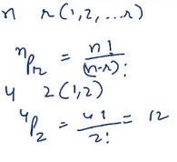
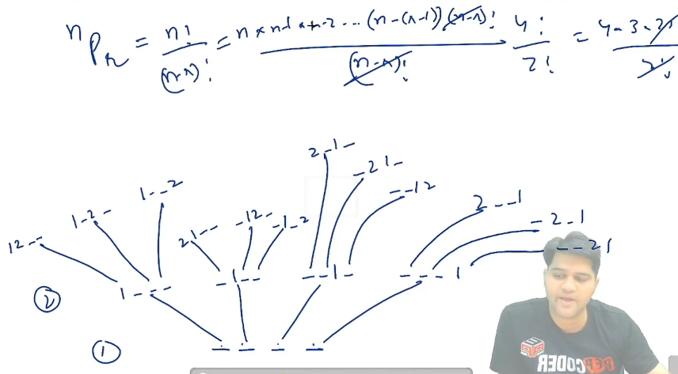

<table>
<colgroup>
<col style="width: 49%" />
<col style="width: 50%" />
</colgroup>
<thead>
<tr class="header">
<th>combination</th>
<th>permutation</th>
</tr>
</thead>
<tbody>
<tr class="odd">
<td>
Ways to place:

r items (similer) in n boxes

= nCr
</td>
<td>
Ways to place:

r item (distinct) n boxes

= nPr
</td>
</tr>
<tr class="even">
<td>
4C2

Placing 2 item in 4 boxes is similar to == selecting 2 boxes out of 4

==============================================

<em>#include</em> &lt;iostream&gt;

using namespace std;

<em>#include</em> &lt;bits/stdc++.h&gt;

void combination(string s, int curr_n, int curr_r, 

int nboxes, int ritems)

{

  <em>if</em> (curr_n == nboxes) {

    <em>if</em> (curr_r == ritems) cout &lt;&lt; s &lt;&lt; endl;

<em>// extra step in subset code</em>

    <em>return</em>;

  }

  combination(s + 'i', curr_n + 1, curr_r + 1, nboxes, ritems);

  combination(s + '*', curr_n + 1, curr_r, nboxes, ritems);

}

int main()

{

  string s = "";

  int idx = 0;

  int nboxes = 4, ritems = 2;

  int curr_n = 0, curr_r = 0;

  combination(s, curr_n, curr_r, nboxes, ritems);

  <em>return</em> 0;

}

Ans :

ii**

i*i*

i**i

*ii*

*i*i

**ii

</td>
<td>
4P2 = selection + arrebgement

<ol type="1">
<li>
first boxes get selected
</li>
<li>
item get placed
</li>
<li>
item get permuted
</li>
</ol>

==============================================

<em>#include</em> &lt;iostream&gt;

using namespace std;

<em>#include</em> &lt;bits/stdc++.h&gt;

void permutation(string s, int curr_r, int r_item)

{

  <em>if</em> (curr_r &gt; r_item) {

    cout &lt;&lt; s &lt;&lt; endl;

    <em>return</em>;

  }

  <em>for</em> (int i = 0; i &lt; s.size(); i++)

  {

    <em>if</em> (s[i] == '*')

    {

      s[i] = '0' + curr_r;

      permutation(s, curr_r + 1, r_item);

      s[i] = '*';

    }

  }

}

int main()

{

  string s = "****"; <em>// nboxes = 4</em>

  permutation(s, 1, 2);

  <em>return</em> 0;

}

Ans :

12**

1*2*

1**2

21**

*12*

*1*2

2*1*

*21*

**12

2**1

*2*1

**21

First level 4 option second level 3 option

n*(n-1)*(n-2) / (n-r)!

The one we solve is perviously is that where we have to premute all items i.e =&gt; n!
</td>
</tr>
</tbody>
</table>

