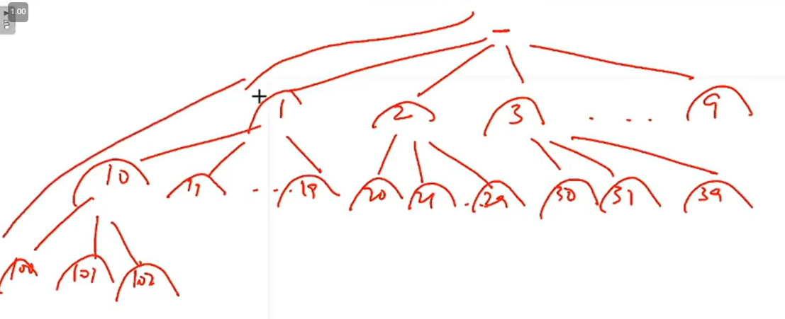

*\#include* \<iostream\>
using namespace std;
*\#include* \<bits/stdc++.h\>
void solve(int i, int n)
{
  *if* (i \> n) *return*;
  cout \<\< i \<\< endl;
  *for* (int k = 0; k \<= 9; k++)
    solve(10 \* i + k, n);
}
int main()
{
  int n = 1000;
  *for* (int i = 1; i \<= 9; i++) {
    solve(i, n);
  }
  *return* 0;
}

============================================

*\#include* \<iostream\>
using namespace std;
*\#include* \<bits/stdc++.h\>
void fun(int n, string tem)
{
  *if* (n == 0) *return*;
  cout \<\< tem \<\< endl;
  *for* (int i = 0; i \<= 9; i++)
    fun(n - 1, tem + to_string(i));
}
int main()
{
  int n = 4;
  string tem = "";
  *for* (int i = 1; i \<= 9; i++)
    fun(n - 1, tem + to_string(i));
  *return* 0;
}

1
10
100
1000
101
102
103
104
105
106
107
108
109
11
110
111
112
113
114
115
116
117
118
119
12
120
121
122
123
124
125
126
127
128
129
13
130
131
132
133
134
135
136
137
138
139
14
140
141
142
143
144
145
146
147
148
149
15
150
151
152
153
154
155
156
157
158
159
16
160
161
162
163
164
165
166
167
168
169
17
170
171
172
173
174
175
176
177
178
179
18
180
181
182
183
184
185
186
187
188
189
19
190
191
192
193
194
195
196
197
198
199
2
20
200
201
202
203
204
205
206
.
.
