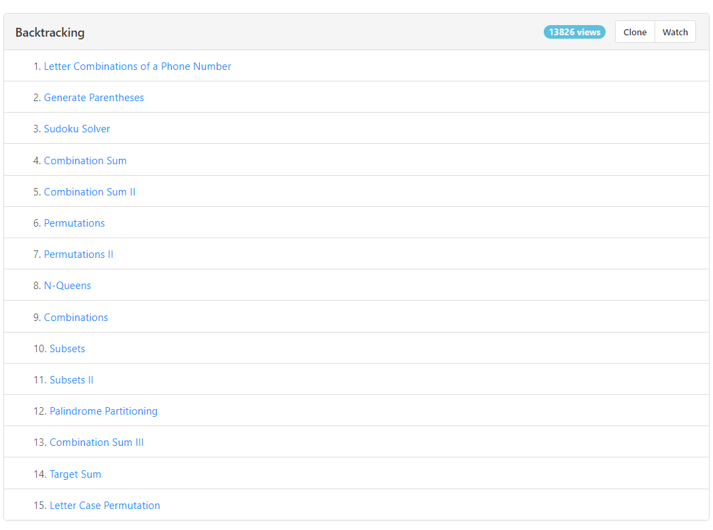

==Types of problems==
1.  Decision Making - n queen,
2.  Optimization - s-\>d
3.  Permutation - abc acb
4.  Subsets - abc-\> a ab abc

==Identify==

Complexity is exponential

constraints -\> are less N\<10 N\<20

no gurantee of which is next step will obtain the soluation

==WE try to find solution using every avaliable choice==

============================================================

Stupid call : handle it in base case

Smart call : handle call with if

