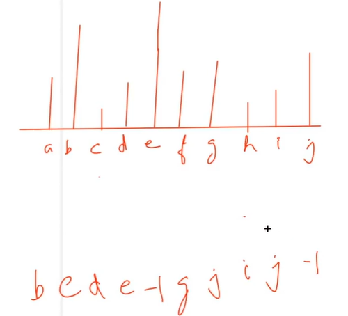
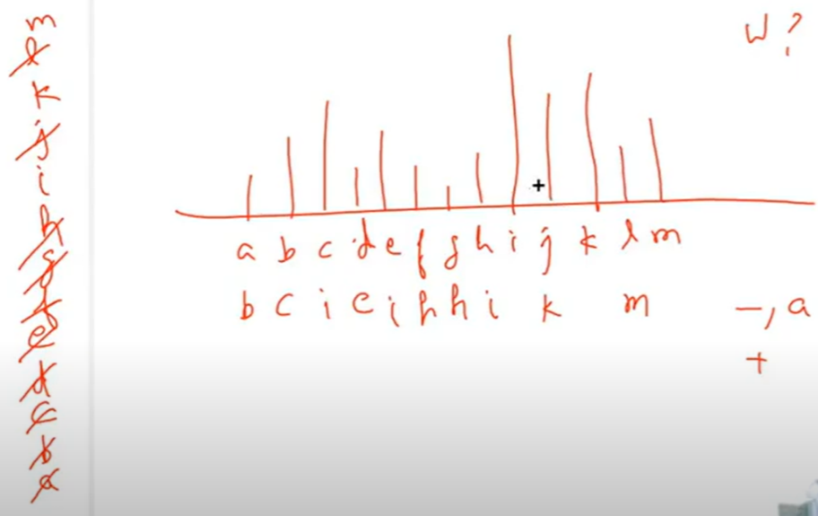

AM

<table>
<colgroup>
<col style="width: 42%" />
<col style="width: 57%" />
</colgroup>
<thead>
<tr class="header">
<th><ol type="1">
<li>
Next Grater Element to right
</li>
</ol>
<blockquote>

[ pop ans push ] [ - a + ]

3 2 2 6 4 1 5 4

6 6 6 -1 5 5 -1 -1

Trick :

if you want next greater to right then start from right and look right

if you want prev smaller to left then start looking from left and look left

</blockquote></th>
<th>

vector&lt;int&gt; nextGreaterElement(vector&lt;int&gt;&amp; arr) {

  int n = arr.size(); stack&lt;int&gt; st;

  vector&lt;int&gt; ans(n); <em>// using index</em>

  <em>for</em> (int i = n - 1; i &gt;= 0; i--)

  {

<em>    // using st.top()] &lt;= arr[i] bcoz we need strictly next greater</em>

    <em>while</em> (!st.empty() &amp;&amp; arr[i] &gt;= arr[st.top()]) st.pop();

    ans[i] = st.empty() ? -1 : arr[st.top()];

    st.push(i); <em>// push index</em>

  }

  <em>for</em> (auto i : ans) cout &lt;&lt; i &lt;&lt; " ";

  <em>return</em> ans;

}

Top is my so :

// if we need next greater then pop arr[i] &gt;= arr[st.top()] loop n -&gt; 0

// if we need next smaller then pop arr[i] &lt;= arr[st.top()] loop n -&gt; 0

// if we need prev greater then pop arr[i] &gt;= arr[st.top()] loop 0 -&gt; n

// if we need prev smaller then pop arr[i] &lt;= arr[st.top()] loop 0 -&gt; n

We can store val = arr[i] at start of while loop to reduce space
</th>
</tr>
</thead>
<tbody>
<tr class="odd">
<td>
<a href="https://leetcode.com/problems/largest-rectangle-in-histogram/">84. Largest Rectangle in Histogram</a>

</td>
<td></td>
</tr>
<tr class="even">
<td>

Stock Span =

span (ith day) = uptill which prev day prize is less

ans = 7

span(ith day) = prev Max se pahele ke stocks

</td>
<td>

</td>
</tr>
<tr class="odd">
<td><ol type="1">
<li>
Alternate Approch :
</li>
</ol>
<blockquote>

Looking greater right &amp; starting from left

[ ( pop ans sath me ) push ]

</blockquote></td>
<td>

</td>
</tr>
</tbody>
</table>

