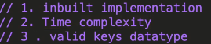

AM

ORDERED MAP =\> O(log n)
1.  STORE \<KEY,VALUE\>
2.  NOT CONTINUES
3.  MAP STORE PAIRS <u>( in key sorted )</u>
4.  BY DEFAULT 0 INSERT In value
5.  UNIQUE KEY STAY BUT CAN BE OVERWRITE
Ex. M\[5\] = "ABC" \|\| M\[5\] = "IJK" overwrite
6.  Time complexity
Inspersion = log(n)

Access and find = log(n)
7.  If there is \<string, string\> s
Complexity =\> string. Size( ) \* log(n)
8.  EVERYTHING STORE IN RED-BLACK TREE
UNORDERED MAP =\> O(1) USE WHEN ORDER NOT MATTER
1.  SAME FUNCTIONS
2.  ORDER NOT MENTAIN
3.  DIFF =\> implementation in hash table

4.  Time complexity
Inspersion = O(1)

Access = O(1)
5.  DEMERIT
Vector, Pair can't use inside coz inbuild hash function of this

type is not defined in STL
SET and UN_SET
O(log n) O(1)

1.  Similarly in unordered set we can't use complex data type
2.  SET store unique =property= just like key in map (sorted)
3.  Un SET use when order not matter and when we just have to find something exist in it or not in O(1) complexity \| cant use vector datatype inside

*//set three type //\*saves unique*

*// ordered = Incresing = search insert O(log n)*

*// un_ordered = Random order = search insert O(1)*

*//\* save dublicate*

*// multiset*

*//map three type //\*saves unique*

*//ordered = Incresing = search insert O(log n)*

*//un_ordered = Random order = search insert O(1)*

*//\* save dublicate*

*// multimap*

***int max = \*ms.begin();***
***int min = \*(--ms.end());***
