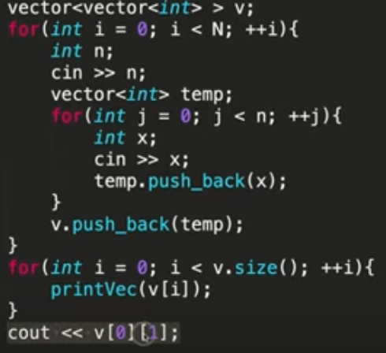

AM

1.  **PAIR =\>**
**USE TO MAINTAIN RELEATION**

**WHEN TWO ARRAY = \> RELEATED**

**SO SWAP SHOULD DONE IN BOTH**
*1)Thelastelement=\>v\[v.size()-1\]*
*2)v.erase(v.begin()+index)//1valueonly*
*3)v.erase(v.begin()+2,v.begin()+5)//putinsiderange*
*ex.{4,2,7,9,3,1,9}=\>{4,2,1,9}*
*4)v.emplace(v.begin()+index,data);//putandshiftfroward*
*5)v.reverse(v.begin(),v.end())//putinsiderange*
*6)intmax=\*max_element(v.begin(),v.end());*
*8)v.insert(v.begin+1,8)//insert8at1stindex*
*9)v.begin()-\>0thindex\|\|v.end()-\>nexttolast*
*v.end()-1-\>lastindex*
*10)v.sort(v.begin(),v.end())*
*11)v.clear()*
*12)v.empty()*
*13)v.fornt()\|\|v.back()*

*Nesting of vectors :*
*how to imagine :*
*1\] vector\<vector\<int\>\> v;*
*v\[i\] kya he it is vector so, v\[i\].push_back() can be used*
*2\] vector\<pair\<int,string\>\> v\[i\] is pair therefore v\[i\].first and v\[i\].second used*

\|
