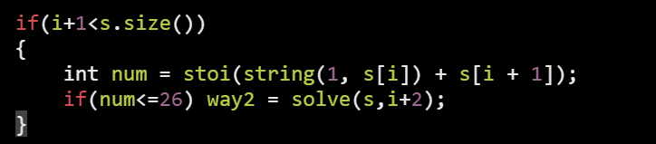

1\) isalnum() =\> *return* true *if* ( abcd or ABCD or 1234)
2\) isalpha() =\> *return* true *if* ( abcd or ABCD )
3\) n() =\> *return* true *if* ( 0 to 9 )
ispunct() isupper() islower()

---------------------------------------------------------

1\) char(toupper('a')) --\> 'A'
2\) char(tolower('a')) --\> 'a'
---------------------------------------------------------

1\) declare : string str(5,'n') *// str = "nnnnn"*
2\) Input line : getline(cin, s);
3\) check empty : s.empty()
---------------------------------------------------------

1\) erase
  s1 = "0123456";
  s1.erase(3, 1); *// "012_456"*
  s1.erase(3, 2); *// "012\_\_56"*
  s1.erase(3); *// "\_\_\_3456" // erase first 3*

2\) sub-string
  s1 = "0123456";
  s2 = s1.substr(3, 2); *// "34"*

3\) check sub-string
  s1 = "0123456";
  int x = s1.find("345"); *// return index*
  *if* (x == -1) cout \<\< "not exist" \<\< endl;
  *else* cout \<\< x \<\< endl; *// 3*

---------------------------------------------------------
*We can't concatinate two charector like*
*string str = s\[i\] + s\[i+1\]*

*use this : string str = string(1, s\[i\]) + s\[i + 1\]);*

char -\> string =\> string str(1,'a');

