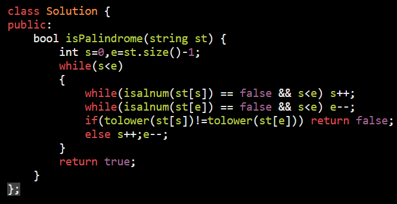
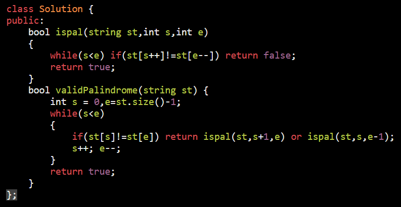
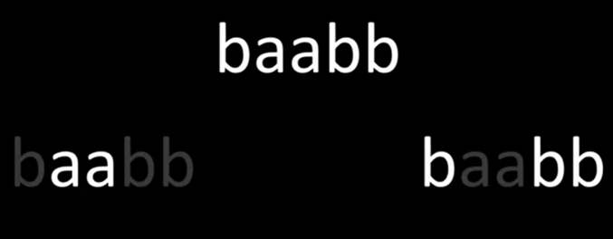
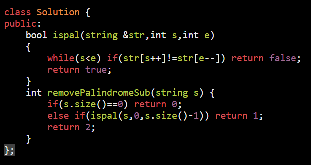
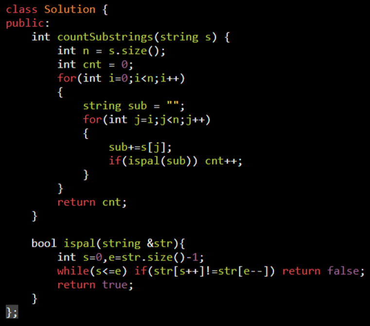
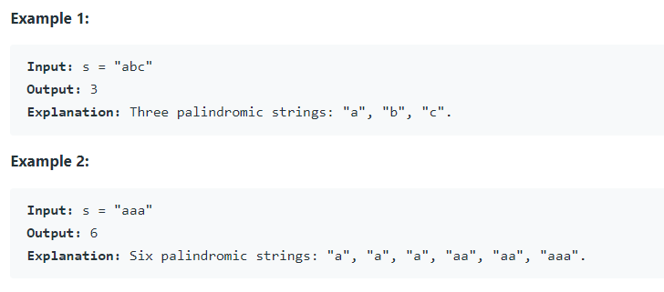
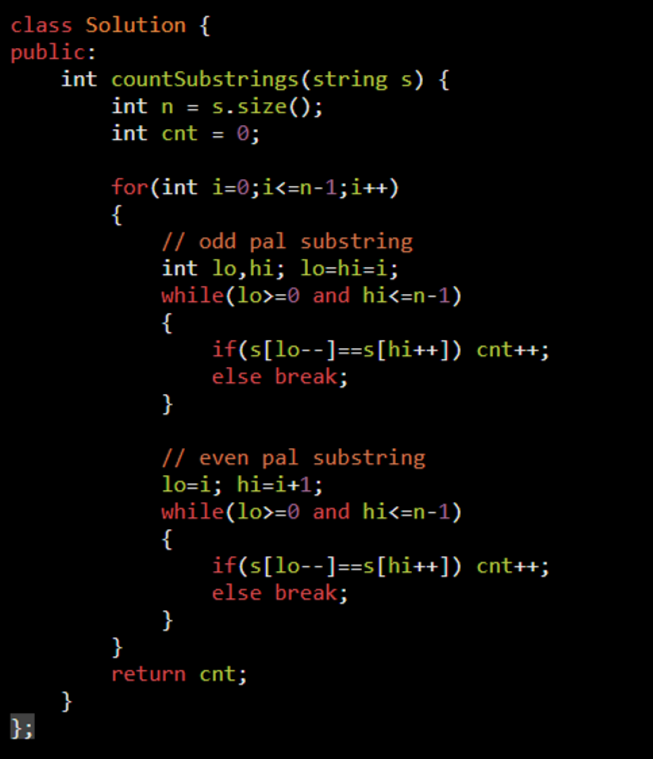

<table>
<colgroup>
<col style="width: 49%" />
<col style="width: 50%" />
</colgroup>
<thead>
<tr class="header">
<th>
<a href="https://leetcode.com/problems/valid-palindrome/">125. Valid Palindrome</a>

char and num allowed : rest ignore

</th>
<th></th>
</tr>
</thead>
<tbody>
<tr class="odd">
<td>
<a href="https://leetcode.com/problems/valid-palindrome-ii/">680. Valid Palindrome II</a>

Can Remove one char:

if d = skiped ae is not pal

if e = skiped de is not pal

return false

"abca" allowed

</td>
<td>

</td>
</tr>
<tr class="even">
<td>
<a href="https://leetcode.com/problems/remove-palindromic-subsequences/">1332. Remove Palindromic Subsequences</a>

Aim = make string empty

: Can Remove pal only -&gt; count as one operation

In a single step you can remove one palindromic subsequence from s.

so there can be only three ans

0 - empty

1 - if pal : abcba direct remove

2 - not pal to make pal - expalnation : substring

</td>
<td>

</td>
</tr>
<tr class="odd">
<td>Can pal substring possible</td>
<td></td>
</tr>
<tr class="even">
<td>
<a href="https://leetcode.com/problems/palindromic-substrings/">647. Palindromic Substrings</a>

<ol type="1">
<li>
BF : O(N^3)
</li>
<li>
OT : O(N^2) with odd &amp; even substring seprate
</li>
</ol>

</td>
<td>

can make more readable by : DRY
</td>
</tr>
<tr class="odd">
<td>
<a href="https://leetcode.com/problems/longest-palindromic-substring/">5. Longest Palindromic Substring</a>

</td>
<td></td>
</tr>
</tbody>
</table>

