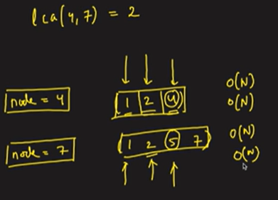
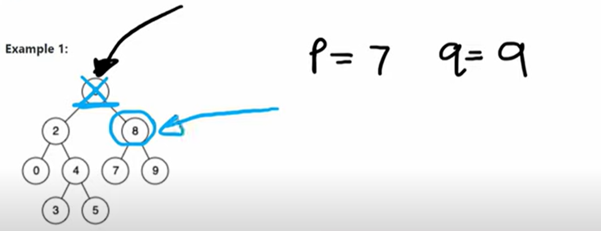
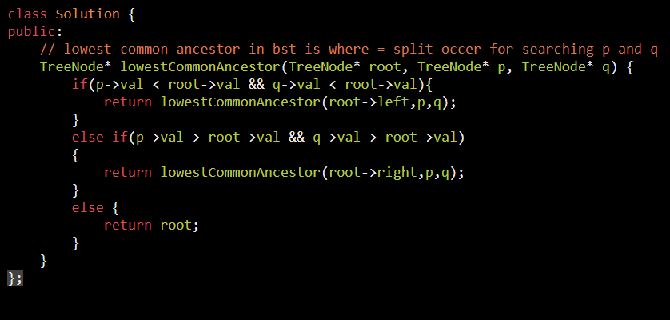

AM

[236. Lowest Common Ancestor of a Binary Tree](https://leetcode.com/problems/lowest-common-ancestor-of-a-binary-tree/)

<table>
<colgroup>
<col style="width: 40%" />
<col style="width: 59%" />
</colgroup>
<thead>
<tr class="header">
<th>
BF =&gt; TC = O(N) SC = O(N)

</th>
<th>

</th>
</tr>
</thead>
<tbody>
<tr class="odd">
<td>
IN BST

</td>
<td>

</td>
</tr>
</tbody>
</table>

