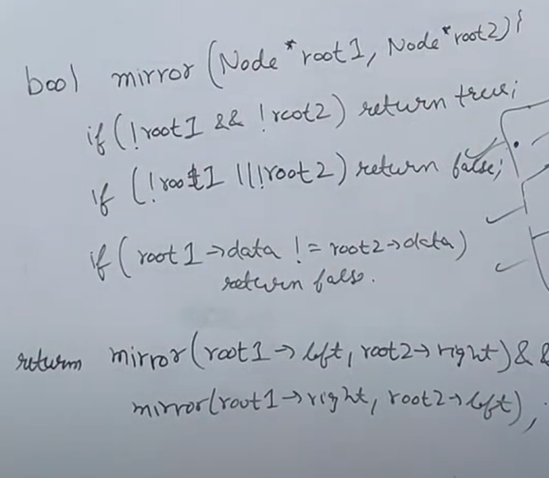
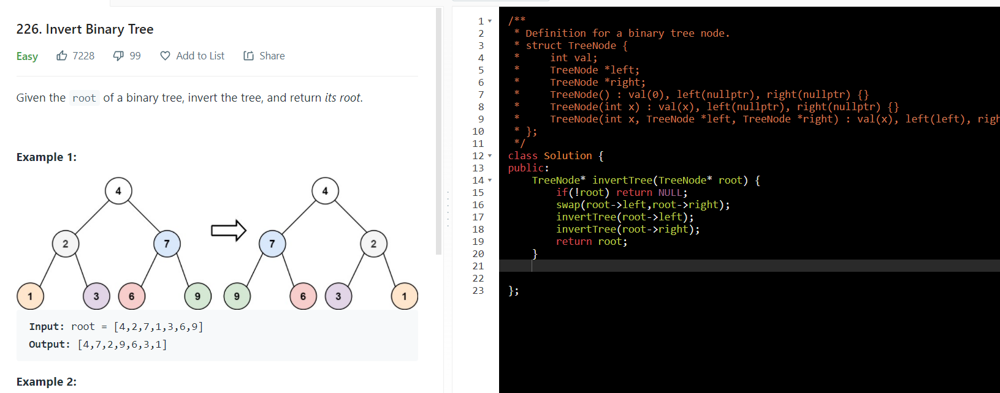

AM
1.  Identical

bool isSameTree(TreeNode \*p,TreeNode \*q)

{

  if(!p and !q ) return true; *//left & right node is NULL*

  if(!p \|\| !q) return false; *//one of them is Not NULL*

  if(p-\>val != q-\>val) return false;

  return isSameTree(p-\>left,q-\>left) && isSameTree(p-\>right,q-\>right);

}

*// comparing left subtree's left child with right subtree's right child*

*// --AND-- comparing left subtree's right child with right subtree's left child*

bool checkMirror(btree \*a,btree \*b){
*  //if both the nodes*
  if(!a && !b)
    return true;

  if(!a \|\| !b \|\| a-\>data != b-\>data)
    return false;

  return checkMirror(a-\>left,b-\>right) && checkMirror(a-\>right,b-\>left);
}

