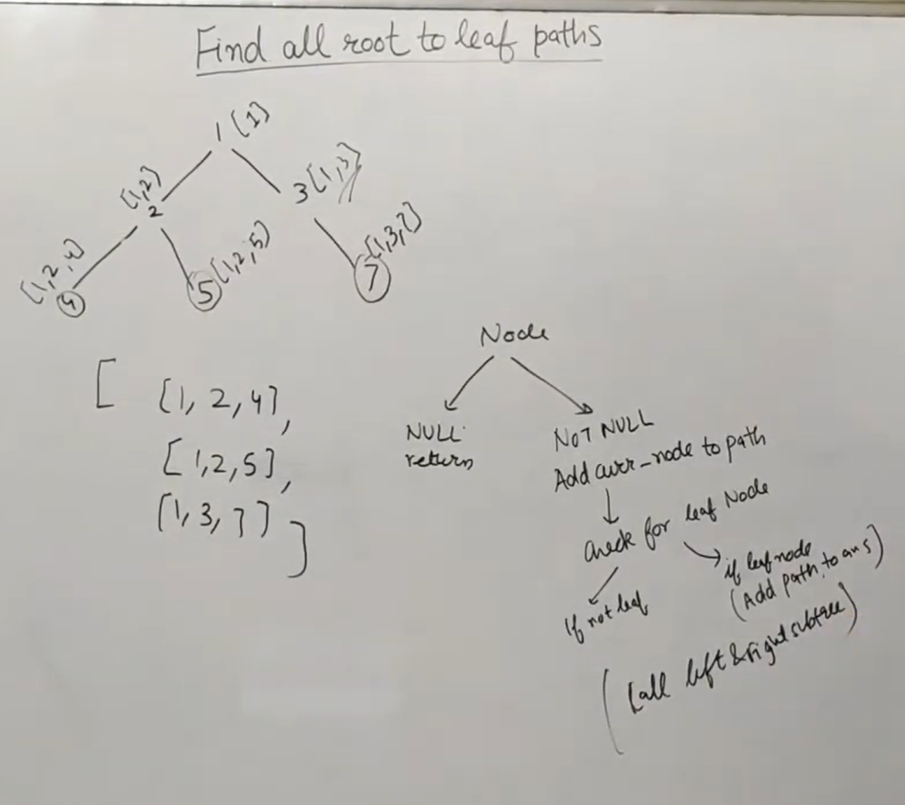
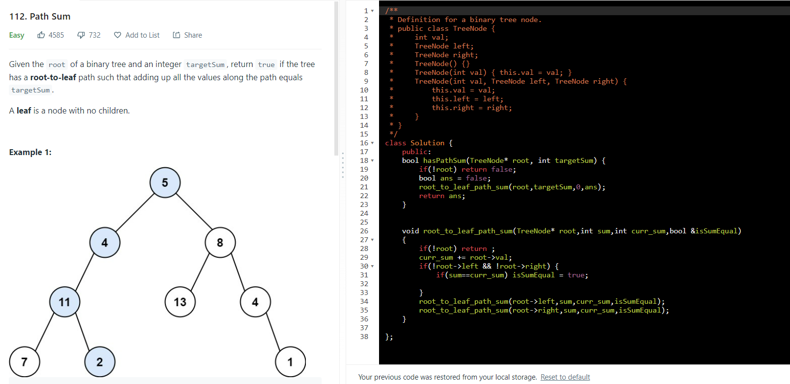
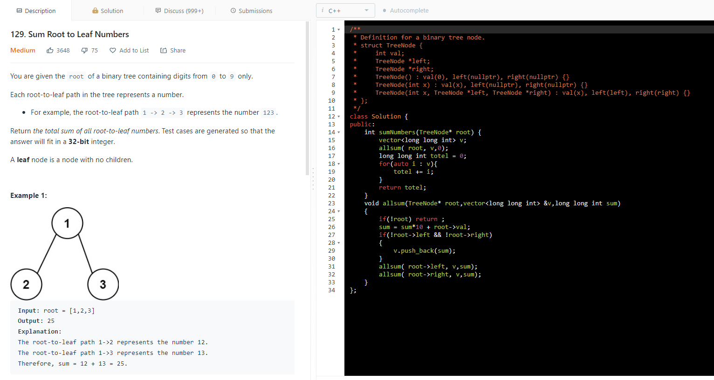
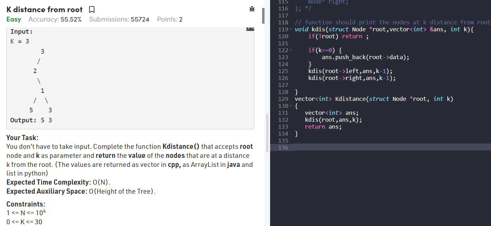

class Solution
{
public:
  void answer(node\* root){

*    // Question 1 **//\* Base Quesion***
    vector\<vector\<int\>\> ans;
    vector\<int\> currpath;
    all_root_to_leaf(root,ans,currpath);
    cout\<\<"All Root to leaf paths " \<\<endl;;
    for (auto &i : ans) {
      for(auto &j: i){
        cout\<\<j\<\<" ";
      }
      cout\<\<endl;
    }
*    // Question 2*
    bool isSumEqual = false;
    root_to_leaf_path_sum(root,7,0,isSumEqual);
    cout\<\<"Root to leaf path sum " \<\< (isSumEqual? "{exist}" : "{not exist}")\<\<endl;
    cout\<\<"Optimized Version "\<\<root_to_leaf_path_sum_2(root,7,0); ***//\* Importnent to know***
*    // Question 3*
    int sum = 0;
    root_to_leaf_max_path_sum(root,sum,0);
    cout\<\<"root_to_leaf_max_path_sum "\<\<sum\<\<endl;
*    // Question 4*
    vector\<long long int\> v;
    sum = 0;
    sum_root_to_leaf_no(root, v,sum);
    int a=0;
    for(auto i : v) a+= i;
    cout\<\<"root_to_leaf_max_path_sum "\<\<a\<\<endl;
  }

  void all_root_to_leaf(node\* root,vector\<vector\<int\>\> &ans,vector\<int\> &currpath)
  {
    if(!root) return ;
    currpath.push_back(root-\>val);
    if(!root-\>left && !root-\>right) {
      ans.push_back(currpath);
    }
    all_root_to_leaf(root-\>left,ans,currpath);
    all_root_to_leaf(root-\>right,ans,currpath);
    currpath.pop_back();
  }
  void root_to_leaf_path_sum(node\* root,int sum,int curr_sum,bool &isSumEqual)
  {
    if(!root) return ;
    curr_sum += root-\>val;
     cout\<\<"running"\<\<endl;
    if(!root-\>left && !root-\>right) {
      if(sum==curr_sum) isSumEqual = true;
    }
    root_to_leaf_path_sum(root-\>left,sum,curr_sum,isSumEqual);
    root_to_leaf_path_sum(root-\>right,sum,curr_sum,isSumEqual);
  }
  bool root_to_leaf_path_sum_2(node\* root,int sum,int curr_sum )
  {
    if(!root) return false;
    curr_sum += root-\>val;
    cout\<\<"running2"\<\<endl;
    if(!root-\>left && !root-\>right) {
      if(sum==curr_sum) return true;

    }
    return root_to_leaf_path_sum_2(root-\>left,sum,curr_sum) \|\|
    root_to_leaf_path_sum_2(root-\>right,sum,curr_sum);
  }
  void root_to_leaf_max_path_sum(node\* root,int &max_sum,int curr_sum)
  {
    if(!root) return ;
    curr_sum += root-\>val;
    if(!root-\>left && !root-\>right) {
      max_sum = max(max_sum,curr_sum);
    }
    root_to_leaf_max_path_sum(root-\>left,max_sum,curr_sum);
    root_to_leaf_max_path_sum(root-\>right,max_sum,curr_sum);
  }
  void sum_root_to_leaf_no (node\* root,vector\<long long int\> &v,long long int sum)
  {
    if(!root) return ;
    sum = sum\*10 + root-\>val;
    if(!root-\>left && !root-\>right)
    {
      v.push_back(sum);
    }
    sum_root_to_leaf_no ( root-\>left, v,sum);
    sum_root_to_leaf_no ( root-\>right, v,sum);
  }
};

