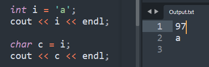

1.  **String to int**
int num=stoi(str1);

2.  **int to String**
string str1=to_string(num);

================================================

1.  **String to flote**
floatnum_float=stof(str3);

================================================

1.  **'4' -\> 4**
inti= '4'-'0'; // Ascii subtraction

2.  **4 -\> '4'**
charc = '0'+'4';

================================================

1.  **Char to int**

inti= 'c'-'a'; // i = 2 'z'-'a'= 25
// make int arr\[26\]

==ASCII value are in int==

1.  'a' = 97 to 'z' = 112
2.  'A' = 65 to 'Z' = 90
3.  '0' = 48 to '9' = 57

