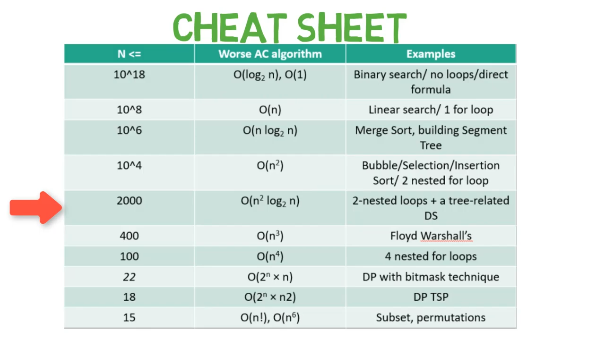

AM

CPU can perform 10^8 operations at 1 second
For Backtracking : 2^26 ~ 10^8 so 1 \<= n \<=26

\> How to calculate No of operations ?
✅ check N
✅ then find fiziable complexity so that op's \<= 10^8

17. you have to sort the numbers N = 10^6
-\> if bobble sort op's =\> 10^12

-\> if merge sort op's =\> 10^7 ✅

op's = nlog(n) = 10^6 \* log(10^6)
= 10^6 \* 3.3 \* 6 apporx =\> 10^7

======================= ShortCut ========================

How to use this sheet
1.  check N constraint if N = 10^5
2.  compiler can pass
O(n) sol as 10^5 \< 10^8

O(nlog(n)) as nlog(n) can pass 10^6 sol

O(n^2) not possible 10^10

conslusion : write code in \| linear or nlog(n)

| N is 10^ | worst sol complexity          | Algo use             |
|----------|-------------------------------|----------------------|
| 8,9,10.. | 1 , log(n)                    | formula, bs          |
| 8,7      | ==n==   | linear, 1 loop       |
| 6        | nlog(n)                       | merge sort, tree rel |
| 10^4     | ==n^2== | for for              |
|         |                              |                     |

Remember :
log2(10) = 3.3
log2(100) = 6.6
log(x) eq 10

----------------------------------------------------

