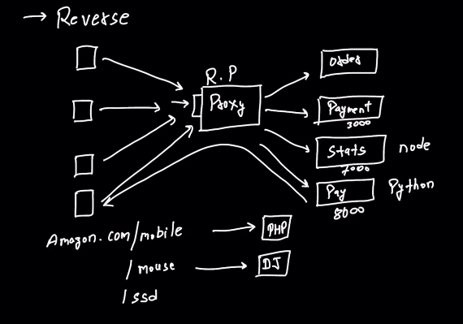

Proxy
- A proxy is an intermediary server or
- It sits between the client (such as a web browser or application) and the destination server, forwarding requests and responses between them.
- can be used for a variety of reasons
  - security, performance,
  - anonymity, and access control.

Proxy Types:
- Forward Proxy:
  - The client sends requests to the proxy, which then forwards those requests to the destination server.
  - It can hide the client's identity, filter payload, and restrict direct access to backend.

+-----------+ +-----------+ +-----------+
\| Client \| ----\> \| Proxy \| ----\> \| Server \|
\| (Browser) \| \| Server \| \| (Website) \|
+-----------+ +-----------+ +-----------+

- Reverse Proxy:
  - It acts on behalf of the server, handling requests from clients and forwarding them to the appropriate server. In this case there are multiple servers.

- It is often used for (feature of proxy)
  - load balancing,
  - security (to hide the backend server),
  - caching.

- Software
  - Nginx

